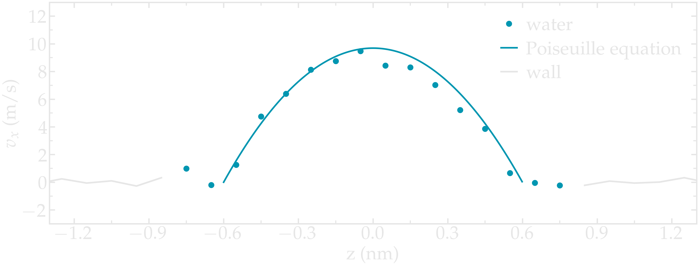

.. _sheared-confined-label:

Nanosheared electrolyte
***********************

.. container:: hatnote

   Aqueous NaCl solution sheared by two walls

.. figure:: ../figures/level2/nanosheared-electrolyte/nanoconfined-electrolyte-dark.png
    :height: 250
    :alt: Electrolyte nano-confined in a slit pore
    :class: only-dark
    :align: right

.. figure:: ../figures/level2/nanosheared-electrolyte/nanoconfined-electrolyte-light.png
    :height: 250
    :alt: Electrolyte nano-confined in a slit pore
    :class: only-light
    :align: right

..  container:: justify

    The objective of this tutorial is to simulate an electrolyte nanoconfined
    and sheared by two walls. The density and velocity profiles of the fluid in
    the direction normal to the walls are extracted to highlight the effect of
    confining a fluid on its local properties. 

..  container:: justify

    This tutorial illustrates some key aspects of
    combining a fluid and a solid in the same simulation.
    A major difference from :ref:`all-atoms-label` is that
    here a rigid four-points water model named TIP4P is used :cite:`abascal2005general`.
    TIP4P is one of the most common water models due to its high accuracy.

.. include:: ../../non-tutorials/recommand-lj.rst

.. include:: ../../non-tutorials/cite.rst

.. include:: ../../non-tutorials/2Aug2023.rst

System preparation
==================

..  container:: justify

    The fluid and walls must first be generated and then equilibrated at a
    reasonable temperature and pressure.

System generation
-----------------

..  container:: justify

    Create a new folder called *systemcreation/*.
    Within *systemcreation/*, open a blank file
    called *input.lammps*, and copy the following lines into it:

..  code-block:: lammps

    boundary p p f
    units real
    atom_style full
    bond_style harmonic
    angle_style harmonic
    pair_style lj/cut/tip4p/long 1 2 1 1 0.1546 12.0
    kspace_style pppm/tip4p 1.0e-4
    kspace_modify slab 3.0

..  container:: justify

    These lines are used to define the most basic parameters,
    including the *atom*, *bond*, and *angle* styles, as well as 
    interaction potential. Here, *lj/cut/tip4p/long* imposes
    a Lennard Jones potential with a cut-off at :math:`12\,\text{Å}`
    and a long-range Coulomb potential. 

..  container:: justify

    So far, the commands are relatively similar to those in the previous tutorial,
    :ref:`all-atoms-label`,
    with two major differences: the use of *lj/cut/tip4p/long*
    instead of *lj/cut/coul/long*,
    and *pppm/tip4p*
    instead of *pppm*. These two tip4p-specific commands allow us to model a four-point water
    molecule without explicitly defining the fourth massless atom *M*. The value of 
    :math:`0.1546\,\text{Å}` corresponds to the *O-M* distance and is 
    imposed by the water model. Here, |TIP4P-2005| is used :cite:`abascal2005general`.

.. |TIP4P-2005| raw:: html

   <a href="http://www.sklogwiki.org/SklogWiki/index.php/TIP4P/2005_model_of_water" target="_blank">TIP4P-2005</a>

..  container:: justify

    Another novelty, here, is the use of *kspace_modify slab 3.0* that is combined
    with the non-periodic boundaries along the *z* coordinate: *boundary p p f*.
    With the *slab* option, the system is treated as periodical along *z*, but with an
    empty volume inserted between the periodic images of the slab, and the interactions
    along *z* effectively turned off.

.. admonition:: About lj/cut/tip4p/long pair style
    :class: info

    The *lj/cut/tip4p/long* pair style is similar to the conventional 
    Lennard Jones and Coulomb interactions, except that it is specifically designed
    for four-point water model (tip4p). The atoms of the water model
    will be type 1 (O) and 2 (H). All the other atoms in the simulation 
    are treated *normally* with long-range Coulomb interaction.

..  container:: justify

    Let us create the box by adding the following lines to *input.lammps*:

..  code-block:: lammps

    lattice fcc 4.04
    region box block -3 3 -3 3 -5 5
    create_box 5 box &
    bond/types 1 &
    angle/types 1 &
    extra/bond/per/atom 2 &
    extra/angle/per/atom 1 &
    extra/special/per/atom 2

..  container:: justify

    The *lattice* command defines the unit
    cell. Here, the face-centered cubic (fcc) lattice with a scale factor of
    4.04 has been chosen for the future positioning of the atoms
    of the walls.

..  container:: justify

    The *region* command defines a geometric
    region of space. By choosing *xlo=-3* and *xhi=3*, and
    because we have previously chosen a lattice with a scale
    factor of 4.04, the region box extends from -12.12 Å to 12.12 Å
    along the x direction.

..  container:: justify

    The *create_box* command creates a simulation box with 5 types of atoms:
    the oxygen and hydrogen of the water molecules,
    the two ions (:math:`\text{Na}^+`,
    :math:`\text{Cl}^-`), and the
    atom of the walls. The *create_box* command extends over 6 lines thanks to the
    :math:`\&` character. The second and third lines are used to
    indicate that the simulation contains 1 type of bond and 1
    type of angle (both required by the water molecule). The parameters for
    these bond and angle constraints will be given later. The
    three last lines are for memory allocation.

..  container:: justify

    Now, we can add atoms to the system. First, let us create two
    sub-regions corresponding respectively to the two solid
    walls, and create a larger region from the union of the two
    regions. Then, let us create atoms of type 5 (the wall) within the two
    regions. Add the following lines to *input.lammps*:

..  code-block:: lammps

    region rbotwall block -3 3 -3 3 -4 -3
    region rtopwall block -3 3 -3 3 3 4
    region rwall union 2 rbotwall rtopwall
    create_atoms 5 region rwall

..  container:: justify

    Atoms will be placed in the positions of the previously
    defined lattice, thus forming fcc solids.

..  container:: justify

    In order to add the water molecules, first
    download the |download_TIP4P2005.txt|
    and place it within *systemcreation/*. The template contains all the
    necessary information concerning the water molecule, such as
    atom positions, bonds, and angles.

.. |download_TIP4P2005.txt| raw:: html

   <a href="../../../../../lammpstutorials-inputs/level2/nanosheared-electrolyte/systemcreation/RigidH2O.txt" target="_blank">molecule template</a>

..  container:: justify

    Add the following lines to *input.lammps*:

..  code-block:: lammps

    region rliquid block INF INF INF INF -2 2
    molecule h2omol RigidH2O.txt
    create_atoms 0 region rliquid mol h2omol 482793

..  container:: justify

    Within the last three lines, a *region* named *rliquid* is created based on the last defined lattice, *fcc 4.04*.
    *rliquid* will be used for depositing the water molecules.

..  container:: justify

    The *molecule* command opens up the molecule template named
    *RigidH2O.txt*, and names the associated molecule *h2omol*.

..  container:: justify

    The new molecules are placed on the *fcc 4.04* lattice
    by the *create_atoms* command. The
    first parameter is 0, meaning that the atom IDs from the
    *RigidH2O.txt* file will be used.
    The number *482793* is a seed that is
    required by LAMMPS, it can be any positive integer.

..  container:: justify

    Finally, let us create 30 ions (15 :math:`\text{Na}^+`
    and 15 :math:`\text{Cl}^-`)
    in between the water molecules, by adding the following commands to *input.lammps*:

..  code-block:: lammps

    create_atoms 3 random 15 52802 rliquid overlap 0.3 maxtry 500
    create_atoms 4 random 15 90182 rliquid overlap 0.3 maxtry 500
    set type 3 charge 1
    set type 4 charge -1

..  container:: justify

    Each *create_atoms* command will add 15 ions at random positions
    within the *rliquid* region, ensuring that there is no *overlap* with existing
    molecules. Feel free to increase or decrease the salt
    concentration by changing the number of desired ions. To keep the system charge neutral,
    always insert the same number of 
    :math:`\text{Na}^+`
    and :math:`\text{Cl}^-`,
    unless there are other charges in the system.

..  container:: justify

    The charges of the newly added ions are specified by the two *set* commands.

..  container:: justify

    Before starting the simulation, we still need to define the parameters of the simulation: the mass
    of the 5 atom types (O, H, :math:`\text{Na}^+`, :math:`\text{Cl}^-`, and wall), the
    pairwise interaction parameters (here, the parameters for the
    Lennard-Jones potential), and the bond and angle parameters.
    Copy the following line into *input.lammps*:

..  code-block:: lammps

    include ../PARM.lammps
    include ../GROUP.lammps

..  container:: justify

    Create a new text file called *PARM.lammps* next to
    the *systemcreation/* folder. Copy the following lines
    into PARM.lammps:

..  code-block:: lammps

    mass 1 15.9994 # water
    mass 2 1.008 # water
    mass 3 28.990 # ion
    mass 4 35.453 # ion
    mass 5 26.9815 # wall

    pair_coeff 1 1 0.185199 3.1589 # water
    pair_coeff 2 2 0.0 1.0 # water
    pair_coeff 3 3 0.04690 2.4299 # ion
    pair_coeff 4 4 0.1500 4.04470 # ion
    pair_coeff 5 5 11.697 2.574 # wall
    pair_coeff 1 5 0.4 2.86645 # water-wall

..  container:: justify
    
    Each *mass* command assigns a mass in grams/mole to an atom type. Each
    *pair_coeff* assigns respectively the depth of the LJ potential
    (in Kcal/mole), and the distance (in Ångstrom) at which the
    particle-particle potential energy is 0.

.. admonition:: About the parameters
    :class: info

    The parameters for water
    correspond to the TIP4P/2005 water model, for which only 
    the oxygen interacts through Lennard-Jones potential, and the parameters
    for :math:`\text{Na}^+` and :math:`\text{Cl}^-` are
    from the CHARMM-27 force field :cite:`mackerell2000development`.

..  container:: justify

    As already seen in previous tutorials and with the important exception of 
    *pair_coeff 1 5*, only pairwise interactions between atoms of identical
    types was assigned. By default, LAMMPS calculates the pair coefficients for
    the interactions between atoms of different types (i and j) by using geometrical average: 
    :math:`\epsilon_{ij} = (\epsilon_{ii} + \epsilon_{jj})/2`, 
    :math:`\sigma_{ij} = (\sigma_{ii} + \sigma_{jj})/2.`.
    If the default value of :math:`5.941\,\text{kcal/mol}`
    was kept for :math:`\epsilon_\text{1-5}`, the solid walls would be extremely
    hydrophilic, causing the water molecule to form dense layers. As a comparison,
    the water-water energy :math:`\epsilon_\text{1-1}` is only
    :math:`0.185199\,\text{kcal/mol}`. Therefore, the walls were made less
    hydrophilic by reducing the value of :math:`\epsilon_\text{1-5}`. Copy the
    following lines into PARM.lammps as well:

..  code-block:: lammps

    bond_coeff 1 0 0.9572 # water

    angle_coeff 1 0 104.52 # water

..  container:: justify

    The *bond_coeff* command, used here for the O-H bond of the water molecule, sets both
    the spring constant of the harmonic potential and the equilibrium distance
    of :math:`0.9572~\text{Å}`. The constant can be 0 for a rigid water molecule,
    because the shape of the molecule will be preserved by the SHAKE algorithm
    (see below) :cite:`ryckaert1977numerical, andersen1983rattle`.
    Similarly, the angle coefficient for the H-O-H angle of the water
    molecule sets the force constant of the angular harmonic potential to 0 and
    the equilibrium angle to :math:`104.52^\circ`.

..  container:: justify

    Let us also create another file called *GROUP.lammps* next
    to *PARM.lammps*, and copy the following lines into it:

..  code-block:: lammps

    group H2O type 1 2
    group Na type 3
    group Cl type 4
    group ions union Na Cl
    group fluid union H2O ions

    group wall type 5
    region rtop block INF INF INF INF 0 INF
    region rbot block INF INF INF INF INF 0
    group top region rtop
    group bot region rbot
    group walltop intersect wall top
    group wallbot intersect wall bot

..  container:: justify

    As it is now, the fluid density within the two walls is too high.
    To avoid high density and pressure, let us add the following lines
    to *input.lammps* to delete about :math:`15~\%`
    of the water molecules:

..  code-block:: lammps

    delete_atoms random fraction 0.15 yes H2O NULL 482793 mol yes

..  container:: justify

    Finally, add the following lines to *input.lammps*:

..  code-block:: lammps

    run 0

    write_data system.data nocoeff
    write_dump all atom dump.lammpstrj

..  container:: justify

    With *run 0*, the simulation will run for 0 steps, which is
    enough for creating the system and saving the final state.

..  container:: justify

    The *write_data* creates a file named *system.data*
    containing all the information required to restart the
    simulation from the final configuration generated by this
    input file. With the *nocoeff* option, the parameters from the force field
    are not written in the *.data* file.

..  container:: justify

    The *write_dump* command prints the final
    positions of the atoms, and can be opened with VMD
    to visualize the system.

..  container:: justify

    Run the *input.lammps* file using LAMMPS. 

.. figure:: ../figures/level2/nanosheared-electrolyte/systemcreation-light.png
    :alt: LAMMPS: electrolyte made of water and salt between walls
    :class: only-light

.. figure:: ../figures/level2/nanosheared-electrolyte/systemcreation-dark.png
    :alt: LAMMPS: electrolyte made of water and salt between walls
    :class: only-dark

..  container:: figurelegend

    Figure: Side view of the system. Periodic images are represented in darker
    colors. Water molecules are in red and white, :math:`\text{Na}^+`
    ions in purple, :math:`\text{Cl}^-` ions in lime, and wall atoms in
    gray. Note the absence of atomic defect at the cell boundaries.
    See the corresponding |youtube_video_nanosheared|.

.. |youtube_video_nanosheared| raw:: html

   <a href="https://youtu.be/SK3FkJt0TmM" target="_blank">video</a>

..  container:: justify

    Always check that your system has been correctly created
    by looking at the periodic images. Atomic defects may
    occur at the boundary.

Energy minimization
-------------------

.. admonition:: Why is energy minimization necessary?
    :class: info

    It is clear from the way the system has been created that
    the atoms are not at equilibrium distances from each
    other. Indeed, some ions added using the *create_atoms*
    commands are too close to the water molecules.
    If we were to start a *normal* (i.e. with a timestep of about 1 fs)
    molecular dynamics simulation now, the atoms
    would exert huge forces on each other, accelerate
    brutally, and the simulation would likely fail.

.. admonition:: Dealing with overlapping atoms
    :class: info

    MD simulations failing due to overlapping atoms are
    extremely common. If it occurs, you can either

    - delete the overlapping atoms using the *delete_atoms* command of LAMMPS,
    - move the atoms to more reasonable distances before the simulation starts using energy minimization, or using molecular dynamics with a small timestep.

..  container:: justify

    Let us move the atoms and place them
    in more energetically favorable positions before starting the simulation.
    Let us call this step *energy minimization*, although it is not 
    a conventional *minimization* as done for instance
    in tutorial :ref:`lennard-jones-label`. Instead, a molecular dynamics simulation
    will be performed here, with some techniques employed to prevent the system
    from exploding due to overlapping atoms.

..  container:: justify

    To perform this energy minimization, let us
    create a new folder named *minimization/* next to *systemcreation/*,
    and create a new input file named *input.lammps* in it. Copy the following lines
    in *input.lammps*:

..  code-block:: lammps

    boundary p p p
    units real
    atom_style full
    bond_style harmonic
    angle_style harmonic
    pair_style lj/cut/tip4p/long 1 2 1 1 0.1546 12.0
    kspace_style pppm/tip4p 1.0e-4
    kspace_modify slab 3.0

    read_data ../systemcreation/system.data

    include ../PARM.lammps
    include ../GROUP.lammps

..  container:: justify

    The only difference from the previous input is that instead
    of creating a new box and new atoms, we open the
    previously created file *system.data* located in *systemcreation/*.
    The file *system.data* contains the definition of the simulation box
    and the positions of the atoms.

..  container:: justify

    Now, let us create a first simulation step using a relatively small 
    timestep (:math:`0.5\,\text{fs}`) and a low temperature
    of :math:`T = 1\,\text{K}`:

..  code-block:: lammps

    fix mynve fluid nve/limit 0.1
    fix myber fluid temp/berendsen 1 1 100
    fix myshk H2O shake 1.0e-4 200 0 b 1 a 1
    timestep 0.5

..  container:: justify

    Just like *fix nve*, the *fix nve/limit* command performs constant NVE integration to
    update the positions and velocities of the atoms at each
    timestep. The difference is that *fix nve/limit* also limits the maximum
    distance atoms can travel at each timestep. The chosen maximum distance in
    :math:`0.1~\text{Å}`. Because the *fix nve/limit* is applied to the group *fluid*,
    only the water molecules and ions will move.

..  container:: justify

    The *fix temp/berendsen* rescales the
    velocities of the atoms to force the temperature of the system
    to reach the desired value of :math:`1~\text{K}`, and the SHAKE algorithm
    is used in order to maintain the shape of the water molecules.

..  container:: justify

    Let us also print the atom positions in a *.lammpstrj* file 
    and control the printing of thermodynamic outputs by
    adding the following lines to *input.lammps*:

..  code-block:: lammps

    dump mydmp all atom 1000 dump.lammpstrj
    thermo 200

..  container:: justify

    Finally, let us run for 4000 steps. Add the 
    following lines to *input.lammps*:

..  code-block:: lammps

    run 4000

..  container:: justify

    In order to better equilibrate the system, let us perform 
    two additional steps with a larger timestep and a higher
    imposed temperature:

..  code-block:: lammps

    fix myber fluid temp/berendsen 300 300 100
    timestep 1.0

    run 4000

    unfix mynve
    fix mynve fluid nve

    run 4000

    write_data system.data nocoeff

..  container:: justify

    For the last of the three steps, fix *nve* is used instead of 
    *nve/limit*, which will allow for a better relaxation of the 
    atom positions.

..  container:: justify

    When running the *input.lammps* file with LAMMPS, you should see that
    the total energy of the system decreases during the first 
    of the 3 steps, before re-increasing a little after the 
    temperature is increased from 1 to :math:`300\,\text{K}`.

.. figure:: ../figures/level2/nanosheared-electrolyte/minimization.png
    :alt: Energy minimisation of the confined water and salt
    :class: only-light

.. figure:: ../figures/level2/nanosheared-electrolyte/minimization-dm.png
    :alt: Energy minimisation of the confined water and salt
    :class: only-dark

..  container:: figurelegend

    Figure: Total energy of the system :math:`E_\text{tot}` as a function of
    time :math:`t` extracted from the log
    file using *Python* and *lammps_logfile*. The vertical dashed lines demarcate the three consecutive steps.

..  container:: justify

    If you look at the trajectory using VMD, you will see that some of the atoms
    are moving, particularly those that were initially in problematic positions. 

System equilibration
--------------------

..  container:: justify

    Let us equilibrate further the entire system by letting both
    fluid and piston relax at ambient temperature.

..  container:: justify

    Create a new folder called *equilibration/* next to 
    the previously created folders, and create a new
    *input.lammps* file in it. Add the following lines to *input.lammps*:

..  code-block:: lammps

    boundary p p f
    units real
    atom_style full
    bond_style harmonic
    angle_style harmonic
    pair_style lj/cut/tip4p/long 1 2 1 1 0.1546 12.0
    kspace_style pppm/tip4p 1.0e-4
    kspace_modify slab 3.0

    read_data ../minimization/system.data

    include ../PARM.lammps
    include ../GROUP.lammps

    fix mynve all nve
    fix myber all temp/berendsen 300 300 100
    fix myshk H2O shake 1.0e-4 200 0 b 1 a 1
    fix myrct all recenter NULL NULL 0
    timestep 1.0

..  container:: justify

    The fix *recenter* has no influence on the dynamics, but will
    keep the system in the center of the box, which makes the
    visualization easier.

..  container:: justify

    Then, add the following lines to *input.lammps* for
    the trajectory visualization and output:

..  code-block:: lammps

    dump mydmp all atom 1000 dump.lammpstrj
    thermo 500
    variable walltopz equal xcm(walltop,z)
    variable wallbotz equal xcm(wallbot,z)
    variable deltaz equal v_walltopz-v_wallbotz
    fix myat1 all ave/time 100 1 100 v_deltaz file interwall_distance.dat

..  container:: justify

    The first two variables extract the centers of mass of
    the two walls. Then, the *deltaz*
    variable is used to calculate the distance between
    the two variables *walltopz*
    and *wallbotz*, i.e. the distance between the two walls.

..  container:: justify

    Finally, let us add the *run* command: 

..  code-block:: lammps

    run 30000
    write_data system.data nocoeff

..  container:: justify

    Run the *input.lammps* file using LAMMPS.

..  container:: justify

    As seen from the data printed by *fix myat1*,
    the distance between the two walls
    reduces until it reaches an equilibrium value.

.. figure:: ../figures/level2/nanosheared-electrolyte/equilibration.png
    :alt: Plot showing the distance between the walls as a function of time.
    :class: only-light

.. figure:: ../figures/level2/nanosheared-electrolyte/equilibration-dm.png
    :alt: Plot showing the distance between the walls as a function of time.
    :class: only-dark

..  container:: figurelegend

    Figure: Distance between the walls as a function of time.
    After a few picoseconds, the distance between the two walls equilibrates near
    its final value. 
    
..  container:: justify

    Note that it is generally recommended to run longer equilibration.
    Here, for instance, the slowest
    process in the system is probably the ionic diffusion. Therefore, the equilibration 
    should in principle be longer than the time
    the ions need to diffuse over the size of the pore
    (:math:`\approx 1.2\,\text{nm}`), i.e. on the order of half a nanosecond.

Imposed shearing
================

..  container:: justify

    From the equilibrated configuration, let us impose a lateral
    motion to the two walls and shear the electrolyte.
    In a new folder called *shearing/*,
    create a new *input.lammps* file that starts like the previous ones:

..  code-block:: lammps

    boundary p p f
    units real
    atom_style full
    bond_style harmonic
    angle_style harmonic
    pair_style lj/cut/tip4p/long 1 2 1 1 0.1546 12.0
    kspace_style pppm/tip4p 1.0e-4
    kspace_modify slab 3.0

..  container:: justify

    Let us import the previously equilibrated data,
    include the parameter and group files,
    and then deal with the dynamics of the system.

..  code-block:: lammps

    read_data ../equilibration/system.data

    include ../PARM.lammps
    include ../GROUP.lammps

    fix mynve all nve
    compute Tfluid fluid temp/partial 0 1 1
    fix myber1 fluid temp/berendsen 300 300 100
    fix_modify myber1 temp Tfluid
    compute Twall wall temp/partial 0 1 1
    fix myber2 wall temp/berendsen 300 300 100
    fix_modify myber2 temp Twall
    fix myshk H2O shake 1.0e-4 200 0 b 1 a 1
    fix myrct all recenter NULL NULL 0

..  container:: justify

    One difference with the previous input is that, here, two thermostats are used,
    one for the fluid (*myber1*) and one
    for the solid (*myber2*). The use of *fix_modify* together
    with *compute temp* ensures that the right temperature value
    is used by the thermostats.

..  container:: justify

    The use of temperature *compute* with *temp/partial 0 1 1*
    is meant to exclude the *x* coordinate from the
    thermalization, which is important since a large velocity
    will be imposed along *x*. 
    
..  container:: justify

    Then, let us impose the velocity of the two walls 
    by adding the following commands to *input.lammps*:

..  code-block:: lammps

    fix mysf1 walltop setforce 0 NULL NULL
    fix mysf2 wallbot setforce 0 NULL NULL
    velocity wallbot set -2e-4 NULL NULL
    velocity walltop set 2e-4 NULL NULL
        
..  container:: justify

    The *setforce* commands cancel the forces on *walltop* and
    *wallbot*, respectively. Therefore the atoms of the two groups do not
    experience any force from the rest of the system. In the absence of force
    acting on those atoms, they will conserve their initial velocity.

..  container:: justify

    The *velocity* commands act only once and impose
    the velocity of the atoms of the groups *wallbot*
    and *walltop*, respectively.

..  container:: justify

    Finally, let us dump the atom positions, extract the
    velocity profiles using several *ave/chunk* commands, extract the
    force applied on the walls, and then run for :math:`200\,\text{ps}`
    Add the following lines to *input.lammps*:

..  code-block:: lammps

    dump mydmp all atom 5000 dump.lammpstrj
    thermo 500
    thermo_modify temp Tfluid

    compute cc1 H2O chunk/atom bin/1d z 0.0 1.0
    compute cc2 wall chunk/atom bin/1d z 0.0 1.0
    compute cc3 ions chunk/atom bin/1d z 0.0 1.0

    fix myac1 H2O ave/chunk 10 15000 200000 &
    cc1 density/mass vx file water.profile_1A.dat
    fix myac2 wall ave/chunk 10 15000 200000 &
    cc2 density/mass vx file wall.profile_1A.dat
    fix myac3 ions ave/chunk 10 15000 200000 &
    cc3 density/mass vx file ions.profile_1A.dat

    fix myat1 all ave/time 10 100 1000 f_mysf1[1] f_mysf2[1] file forces.dat

    timestep 1.0
    run 200000
    write_data system.data nocoeff

..  container:: justify

    Here, a binning of :math:`1\,\text{Å}` is used for the density profiles
    generated by the *ave/chunk* commands. For smoother profiles, you can
    reduce its value.

..  container:: justify

    The averaged velocity profile of the fluid 
    can be plotted. As expected for such Couette flow geometry, the velocity
    of the fluid is found to increase linearly along :math:`z`.

.. figure:: ../figures/level2/nanosheared-electrolyte/shearing.png
    :alt: Velocity of the nanosheared fluid
    :class: only-light

.. figure:: ../figures/level2/nanosheared-electrolyte/shearing-dm.png
    :alt: Velocity of the nanosheared fluid
    :class: only-dark

..  container:: figurelegend

    Figure: Velocity profiles for water molecules, ions and walls
    along the *z* axis. The line is a linear fit assuming that 
    the pore size is :math:`h = 1.8\,\text{nm}`.

.. figure:: ../figures/level2/nanosheared-electrolyte/density.png
    :alt: density of the nanosheared fluid
    :class: only-light

.. figure:: ../figures/level2/nanosheared-electrolyte/density-dm.png
    :alt: density of the nanosheared fluid
    :class: only-dark

..  container:: figurelegend

    Figure: Water density :math:`\rho` profile
    along the *z* axis.

..  container:: justify

    From the force applied by the fluid on the solid, one can
    extract the stress within the fluid, which allows for the measurement of
    its viscosity :math:`\dot{\eta}` 
    according to |reference_gravelle2021|:
    :math:`\eta = \tau / \dot{\gamma}` where :math:`\tau`
    is the stress applied by the fluid on the shearing wall, and
    :math:`\dot{\gamma}` the shear rate (which is imposed
    here) :cite:`gravelle2021violations`. Here, the shear rate
    is approximatively :math:`\dot{\gamma} = 16 \cdot 10^9\,\text{s}^{-1}`,
    and using a surface area of :math:`A = 6 \cdot 10^{-18}\,\text{m}^2`, one
    gets an estimate for the shear viscosity for the confined
    fluid of :math:`\eta = 6.6\,\text{mPa.s}`.

.. |reference_gravelle2021| raw:: html

   <a href="https://pure.tudelft.nl/ws/portalfiles/portal/89280267/PhysRevFluids.6.034303.pdf" target="_blank">gravelle2021</a>

..  container:: justify

    The viscosity calculated at such a high shear rate may
    differ from the expected *bulk* value. In general, it is recommended to use a lower
    value for the shear rate. Note that for lower shear rates, the ratio of noise-to-signal
    is larger, and longer simulations are needed.

..  container:: justify

    Another important point to keep in mind is that the viscosity of a fluid
    next to a solid surface is typically larger than in bulk due to interaction with the
    walls :cite:`wolde-kidanInterplayInterfacialViscosity2021`. Therefore, one expects the present simulation to return 
    a viscosity that is slightly larger than what would
    be measured in the absence of a wall.

.. include:: ../../non-tutorials/accessfile.rst

Going further with exercises
============================

.. include:: ../../non-tutorials/link-to-solutions.rst

Induce a Poiseuille flow
------------------------

..  container:: justify

    Instead of inducing a shearing of the fluid using the walls,
    induce a net flux of the liquid in the direction tangential
    to the walls. The walls must be kept immobile.

..  container:: justify
    
    Extract the velocity profile, and make sure that the
    resulting velocity profile is consistent with the Poiseuille equation,
    which can be derived from the Stokes equation :math:`\eta \nabla \textbf{v} = - \textbf{f} \rho`
    where :math:`f` is the applied force,
    :math:`\rho` is the fluid density,
    :math:`\eta` is the fluid viscosity.

.. figure:: ../figures/level2/nanosheared-electrolyte/shearing-poiseuille-light.png
    :alt: Velocity of the fluid forming a Poiseuille flow
    :class: only-light

..  container:: figurelegend

    Figure: Velocity profiles of the water molecules along the *z* axis (disks).
    The line is the Poiseuille equation.

..  container:: justify

    An important step is to choose the proper value for the additional force.