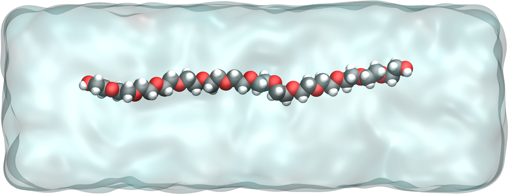

.. _`all-atoms-label`:

Polymer in water
****************

.. container:: hatnote

   Stretching a small solvated molecule

.. figure:: ../figures/level2/polymer-in-water/video-PEG-dark.webp
    :alt: Movie of a peg molecule in water as simulated with LAMMPS
    :height: 250
    :align: right
    :class: only-dark

.. figure:: ../figures/level2/polymer-in-water/video-PEG-light.webp
    :alt: Movie of a peg molecule in water as simulated with LAMMPS
    :height: 250
    :align: right
    :class: only-light

..  container:: justify

   The goal of this tutorial is to use LAMMPS and
   create a small hydrophilic polymer (PEG -
   PolyEthylene Glycol) in a reservoir of water. 
   An all-atom description is used, therefore all species considered here
   are made of charged atoms connected by bonds constraints.

   Once the system is created, a constant stretching force will be applied to both
   ends of the polymer, and its length will be measured with time.

   This tutorial was inspired by a very nice |Liese2017| by Liese and coworkers, in which
   they compare MD simulations with force spectroscopy experiments.

.. |Liese2017| raw:: html

   <a href="https://doi.org/10.1021/acsnano.6b07071" target="_blank">publication</a>

.. include:: ../../contact/recommand-lj.rst

.. include:: ../../contact/needhelp.rst

Bulk water
==========

..  container:: justify

   As a first step, a rectangular box of water is created and
   equilibrated at ambient temperature and ambient pressure (the PEG molecule will be added in the next sections).

   Create a folder named pureH2O/. Inside this folder, create
   an empty text file named input.lammps. Copy the following
   lines in it:

..  code-block:: lammps
   :caption: *to be copied in pureH2O/input.lammps*

   # LAMMPS input script
   units real
   atom_style full
   bond_style harmonic
   angle_style charmm
   dihedral_style charmm
   pair_style lj/cut/tip4p/long 1 2 1 1 0.105 12.0
   kspace_style pppm/tip4p 1.0e-4

..  container:: justify

   There are many differences with respect to
   the previous tutorial (:ref:`lennard-jones-label`), mostly
   because here a system with molecules and partial charges is
   modeled (instead of neutral particles). With the unit style 'real',
   masses are in grams per
   mole, distances in Ångstroms, time in femtoseconds, energies
   in Kcal/mole. With the atom style 'full', each atom is a dot
   with a mass and a charge. In addition, each atom can be
   linked by bonds, angles, dihedrals and impropers potentials
   (for example to form molecules). The 'bond_style',
   'angle_style', and 'dihedral_style' commands define the
   styles of bond angle, and dihedrals used in the simulation,
   respectively, and the 'harmonic' and 'charmm' keywords
   impose the type of potential to use.

.. admonition:: About the use of charmm style
    :class: info

    The future merging of the water with the PEG
    has already been anticipated as the charmm angle_style
    and dihedral_style are requirements of the PEG's model.

    A rigid water model will be used here, so the bond
    and angle styles that are chosen have no consequence on the water model, they will
    only matter to the PEG when it is added.

..  container:: justify

   With the 'pair_style' named 'lj/cut/tip4p/long', atoms
   interact through both a Lennard-Jones (LJ) potential and
   through Coulombic interactions. This pair style is specific to
   four points water models, and automatically accounts for the
   additional massless site. The six numbers are, respectively,

-  **1 -** the atom type for the oxygen O of the tip4p water,
-  **2 -** the atom type for the hydrogen H of the tip4p water,
-  **3 -** the OH bond type,
-  **4 -** the HOH angle type,
-  **5 -** the distance from O atom to the massless charge (here 0.105 Ångstroms is set by the TIP4P/epsilon water model),
-  **6 -** the cutoff (here of 12 Ångstroms).

.. admonition:: About cutoff in molecular dynamics
    :class: info

    The cutoff of 12 Ångstroms applies to both LJ and Coulombic
    interactions, but in a different way. For LJ 'cut'
    interactions, atoms interact with each others only if they
    are separated by a distance smaller than the cutoff. For
    Coulombic 'long', interaction between atoms closer than
    the cutoff are computed directly, and interaction between
    atoms outside that cutoff are computed in the reciprocal
    space.

..  container:: justify

   Finally the kspace command defines the long-range solver for the (long)
   Coulombic interactions. The pppm style refers to
   particle-particle particle-mesh.

.. admonition:: Background Information (optional) -- About PPPM
    :class: dropdown

    *The PPPM
    method is based on separating the total interaction
    between particles into the sum of short-range
    interactions, which are computed by direct
    particle-particle summation, and long-range interactions,
    which are calculated by solving Poisson's equation using
    periodic boundary conditions (PBCs).* 
    |Luty and van Gunsteren|

.. |Luty and van Gunsteren| raw:: html

   <a href="https://doi.org/10.1021/jp9518623" target="_blank">Luty and van Gunsteren</a>

..  container:: justify

   Then, let us create a 3D simulation box of dimensions 8 x 3
   x 3 nm^3, and make space for 7 atom types (1 and 2 for
   the water oxygen and hydrogen, respectively, and 3, 4, 5, 6
   and 7 for the PEG molecule (see below)), 6 bond types, 9
   angle types, and 14 dihedrals types.

..  code-block:: lammps
   :caption: *to be copied in pureH2O/input.lammps*

   region box block -40 40 -15 15 -15 15
   create_box 7 box &
   bond/types 6 &
   angle/types 9 &
   dihedral/types 14 &
   extra/bond/per/atom 2 &
   extra/angle/per/atom 1 &
   extra/special/per/atom 2

.. admonition:: About extra per atom commands
    :class: info

    The extra/[something]/per/atom commands are here for
    memory allocation, they ensure that enough space is left for a
    certain number of attribute for each atom. We wont worry
    about those commands in this tutorial, just keep that in mind if one day you see the following
    error message:

    ..  code-block:: bash

        ERROR: Molecule topology/atom exceeds system topology/atom (src/molecule.cpp:1767)

..  container:: justify

    Let us include a parameter file containing all the
    parameters (masses, interaction energies, bond equilibrium
    distances, etc):

..  code-block:: lammps
   :caption: *to be copied in pureH2O/input.lammps*

   include ../PARM.lammps

..  container:: justify

   Next to the pureH2O/ folder, create a blank file called
   PARM.lammps and copy the following lines in it:

..  code-block:: lammps
   :caption: *to be copied in PARM.lammps*

   # Mass
   mass 1 15.9994 # H2O O
   mass 2 1.008 # H2O H
   mass 3 12.011 # CC32A
   mass 4 15.9994 # OC30A
   mass 5 1.008 # HCA2
   mass 6 15.9994 # OC311
   mass 7 1.008 # HCP1

   # Pair Coeff
   pair_coeff 1 1 0.18479 3.165 # H2O - TIP4P - epsilon water model
   pair_coeff 2 2 0.0 0.0 # H2O H
   pair_coeff 3 3 0.056 3.58141 # CC32A
   pair_coeff 4 4 0.100 2.93997 # OC30A
   pair_coeff 5 5 0.035 2.38761 # HCA2
   pair_coeff 6 6 0.192 3.14487 # OC311
   pair_coeff 7 7 0.046 0.40001 # HCP1

   # Bond coeff
   bond_coeff 1 0 0.9572 # H2O O-H
   bond_coeff 2 222.35 1.5300
   bond_coeff 3 308.79 1.1111
   bond_coeff 4 359.76 1.1415
   bond_coeff 5 427.715 1.1420
   bond_coeff 6 544.635 0.9600

   # Angle coeff
   angle_coeff 1 0 104.52 0 0 # H2O H-O-H
   angle_coeff 2 50.0000 109.0000 0.0000 0.0000
   angle_coeff 3 26.5000 110.1000 22.5300 2.179   
   angle_coeff 4 45.0000 111.5000 0.0000 0.0000 
   angle_coeff 5 13.0258 109.4000 0.0000 0.0000
   angle_coeff 6 35.5000 109.0000 5.4000 1.802
   angle_coeff 7 55.0000 108.8900 0.0000 0.0000
   angle_coeff 8 75.7000 110.1000 0.0000 0.0000
   angle_coeff 9 95.0000 109.7000 0.0000 0.0000
         
   # Dihedral coeff
   dihedral_coeff 1 0.57 1 0 0
   dihedral_coeff 2 0.29 2 0 0
   dihedral_coeff 3 0.43 3 0 0
   dihedral_coeff 4 0.59 1 180 0
   dihedral_coeff 5 1.16 2 0 0 
   dihedral_coeff 6 0.12 1 0 0 
   dihedral_coeff 7 0.42 2 0 0
   dihedral_coeff 8 0.29 3 0 0
   dihedral_coeff 9 2.87 1 180 0
   dihedral_coeff 10 0.03 2 0 0
   dihedral_coeff 11 0.23 3 0 0
   dihedral_coeff 12 1.36 1 180 0
   dihedral_coeff 13 0.16 2 0 0
   dihedral_coeff 14 1.01 3 0 0

..  container:: justify

   If you want to know which column refers to which
   parameter, you can refer to the LAMMPS documentation. For
   this tutorial, we will just trust that these parameters
   are correct and will lead to physically consistent
   behavior.
   Now, let us create water molecules. To do so, let us
   define a water molecule using a molecule template called
   H2OTip4p.txt, and randomly create 700 of those.

..  code-block:: lammps
   :caption: *to be copied in pureH2O/input.lammps*

   molecule h2omol H2OTip4p.txt
   create_atoms 0 random 700 456415 NULL mol h2omol 454756

..  container:: justify

   The molecule template named H2OTip4p.txt must be |download_H2OTip4p.txt|
   and saved in the same folder (named pureH2O/) as the
   input.lammps file. This template contains all the necessary structural
   information of a water molecule, such as the number of atoms, 
   which pair of atoms are connected by bonds, which
   groups of atoms are connected by angles, etc.

   Then, let us group the atoms of the water in a group named
   H2O, and then delete the overlapping molecules:

.. |download_H20.data| raw:: html

   <a href="../../../../../inputs/level2/polymer-in-water/pureH2O/H2O.data" target="_blank">download</a>

.. |download_H2OTip4p.txt| raw:: html

   <a href="../../../../../inputs/level2/polymer-in-water/pureH2O/H2OTip4p.txt" target="_blank">downloaded</a>

..  code-block:: lammps
    :caption: *to be copied in pureH2O/input.lammps*

    group H2O type 1 2
    delete_atoms overlap 2 H2O H2O mol yes

..  container:: justify

    Deleting overlapping molecules is required here
    because the molecules where placed randomly in space by
    the "create_atoms" command, and some of them may be too
    close from each other, which may force the simulation to
    crash.

    The "mol yes" option ensures that entire water molecules are deleted and not just single atoms.

    Let us use the shake algorithm in order to constrain the
    shape of the water molecules at all time. Let us also use the fix NPT to
    control both the temperature and the pressure:

..  code-block:: lammps
    :caption: *to be copied in pureH2O/input.lammps*

    fix myshk H2O shake 1.0e-5 200 0 b 1 a 1 mol h2omol
    fix mynpt all npt temp 300 300 100 iso 1 1 1000

..  container:: justify

    The parameters of the fix shake specify to
    which group (H2O) the shake algorithm applied, with what
    tolerance (1e-5). Still in the shake command, we also supply
    the molecule template (h2omol) previously defined, and
    specify to which bond/angle type shake mush apply, i.e. the
    bond of type 1 and the angle of type 1.

    The fix NPT allows us to impose both a temperature of 300 K (with a damping constant of 100 fs),
    and a pressure of 1 atmosphere (with a damping constant of 1000 fs). With the iso keyword, the
    three dimensions of the box will be re-scaled simultaneously, until the average pressure in the system 
    corresponds to the desired imposed value of 1 atm.

.. admonition:: About rigid water model
    :class: info

    With shake, water molecules behave as rigid. If
    you want to study the vibration of the O-H bonds and
    H-O-H angles, you will have to use a flexible water
    model. If you want to study the hydrogen transfer, you
    will have to use a reactive force field, as done in :ref:`reactive-silicon-dioxide-label`.

..  container:: justify

    Here only the water molecules will be rigid, the
    PEG molecule (which will be added in the next part) will
    be fully flexible.

    Let us print the atom positions in a dump file every 1000
    timesteps (i.e. 1 ps), print the temperature volume, and
    density every 100 timesteps in 3 separate data files, and
    print the information in the terminal every 1000 timesteps:

..  code-block:: lammps
   :caption: *to be copied in pureH2O/input.lammps*

   dump mydmp all atom 1000 dump.lammpstrj
   variable mytemp equal temp
   variable myvol equal vol
   fix myat1 all ave/time 10 10 100 v_mytemp file temperature.dat
   fix myat2 all ave/time 10 10 100 v_myvol file volume.dat
   variable myoxy equal count(H2O)/3 # divide by 3 to get the number of molecule, not atom
   variable mydensity equal ${myoxy}/v_myvol
   fix myat3 all ave/time 10 10 100 v_mydensity file density.dat
   thermo 1000

.. admonition:: The difference between ${var} and v_var
    :class: info

    Both ${var} and v_var can be used to call a previously defined variable named var. 
    However, ${var} returns the initial value of var, while v_var returns the instantaneous 
    value of var. 

..  container:: justify

    In the formula for the density (number of
    molecule divided by volume), the underscore '_' is used to
    call myvol because the volume is expected
    to evolve in time when using fix NPT, but the dollar sign '$' is used to call myoxy as the
    number of molecules is not expected to evolve during the
    simulation. Note that the number of molecule changes after the
    delete_atoms command is used, but this is done only before the
    simulation starts.
    Finally, let us set the timestep to 2.0 fs, and run the simulation for 50 ps:

..  code-block:: lammps
   :caption: *to be copied in pureH2O/input.lammps*

   timestep 2.0
   run 25000
   write_data H2O.data

..  container:: justify

   Looking at the log file, one can see how many atoms have
   been deleted (the number will vary depending on the random
   number you choose).

..  code-block:: bw

   Deleted 714 atoms, new total = 1386
   Deleted 476 bonds, new total = 924
   Deleted 238 angles, new total = 462

..  container:: justify

   About 30 % the molecules were deleted due to overlapping,
   together with their respective bonds and angles.
   At the end of the simulation, the final state is printed
   in the H2O.data file, which will be used later.

.. admonition:: Running LAMMPS in parallel
    :class: info

    This simulation may be a bit slow to complete on 1 single core.
    You can speed it up by running LAMMPS on 2, 4 or even more cores, by typing:

    .. code-block:: bash

        mpirun -np 4 lmp -in input.lammps

    Here 4 core are used. The command may vary, depending on your OS and LAMMPS installation.

.. admonition:: Background Information (optional) -- Choosing the right number of cores
    :class: dropdown

    When running a simulation in parallel using more than one CPU core, LAMMPS divides the system into
    blocks, and each core is assigned to a given block. Here, as can be seen from the terminal, when using 'mpirun -np 4', LAMMPS divides 
    the system into 4 blocks along the x axis:

    .. code-block:: bash
    
        Created orthogonal box = (-40.000000 -15.000000 -15.000000) to (40.000000 15.000000 15.000000)
         4 by 1 by 1 MPI processor grid

    You can force LAMMPS to divide the system differently, let us say along both y and z axis,
    by using the command 

    ..  code-block:: lammps

        processors 1 2 2

    However, communication between the different cores slows down the computation, so ideally you want 
    to minimize the size of the surface between domains. Here the default choice of LAMMPS (i.e. processors 4 1 1)
    is certainly a better choice.

    If you don't know what is the best number of processors or the best way to cut the system, just perform 
    a short simulation and look at the log file. For instance, if I run the simulation on 1 core I get : 

    .. code-block:: bash

        Performance: 31.567 ns/day, 0.760 hours/ns, 182.680 timesteps/s

    On 4 cores (keeping the default processors 4 1 1):

    .. code-block:: bash

        Performance: 109.631 ns/day, 0.219 hours/ns, 634.440 timesteps/s

    This is much faster, but this is not 4 times faster, because of the cost of communicating between processors.

    On 4 cores and enforcing the stupid choice: processors 1 2 2, I get

    .. code-block:: bash

        Performance: 99.864 ns/day, 0.240 hours/ns, 577.919 timesteps/s

    Its not so bad but still not at good as 4 1 1. 

    On 8 cores (the max I got), I get :

    .. code-block:: bash

        4 by 1 by 2 MPI processor grid

        ...

        Performance: 152.106 ns/day, 0.158 hours/ns, 880.243 timesteps/s

    So LAMMPS chooses to divide the system once along z, and 4 times along x, and the speed is improved, but again the improvement 
    is not linear with the number of cores. 

    **Choose carefully the best number of cores for your simulation so that you don't waste computational resource.
    Sometimes it is better to run 2 simulations on 2 cores each than 1 simulation on 4 cores.**

..  container:: justify

   Note that no energy minimization was performed here (NPT
   molecular dynamics was started straight away). This is a
   bit risky, but it works here because overlapping
   molecules were deleted, and because the initial density
   is very low.

   If you open the dump.lammpstrj file using VMD, you should
   see the system reaching its equilibrium volume:

.. figure:: ../figures/level2/polymer-in-water/water_light.webp
   :alt: Bulk water system
   :class: only-light

.. figure:: ../figures/level2/polymer-in-water/water_dark.webp
   :alt: Bulk water system
   :class: only-dark

   Video: water molecules during NPT equilibration.

..  container:: justify

   You can also open the temperature.dat and density.dat files
   to ensure that the system converged toward an equilibrated
   liquid system during the 50 ps of simulation:

.. figure:: ../figures/level2/polymer-in-water/equilibration_H2O_light.png
    :alt: Curves showing the equilibration of the water reservoir
    :class: only-light

.. figure:: ../figures/level2/polymer-in-water/equilibration_H2O_dark.png
    :alt: Curves showing the equilibration of the water reservoir
    :class: only-dark

    The graph on the left shows the evolution of the temperature
    with time, and the graph on the right the evolution of the
    density.

..  container:: justify

   Alternatively, you can |download_H2O.data|
   the water reservoir I have equilibrated and continue with
   the tutorial.

.. |download_H2O.data| raw:: html

   <a href="../../../../../inputs/level2/polymer-in-water/pureH2O/H2O.data" target="_blank">download</a>

.. include:: ../../contact/supportme.rst

PEG molecule
============

..  container:: justify

    Now that the water box is ready, let us prepare the PEG
    molecule in an empty box. Create a second folder next to pureH2O/, call it
    singlePEG/, and create a new blank file called input.lammps
    in it. Copy the same first lines as previously:

..  code-block:: lammps
    :caption: *to be copied in singlePEG/input.lammps*

    units real
    atom_style full
    bond_style harmonic
    angle_style charmm
    dihedral_style charmm
    pair_style lj/cut/tip4p/long 1 2 1 1 0.105 12.0
    kspace_style pppm/tip4p 1.0e-4

..  container:: justify

    Let us also add the special_bonds command to cancel the
    Lennard-Jones interactions between the closest
    atoms of a same molecule:

..  code-block:: lammps
    :caption: *to be copied in singlePEG/input.lammps*

    special_bonds lj/coul 0.0 0.0 0.5

.. admonition:: About special_bonds
    :class: info

    Usually, force fields like charmm are parametrized assuming that the first neighbors within a molecule do not
    interact directly. Here, since we use 0.0 0.0 0.5, the first (for example C-O) and second (for example C-O-H) neighbors don't interact
    with each other through LJ and Coulomb potentials, and therefore they only interact through direct bond interactions.
    For the third neighbor (for example H-C-C-H), only half of the LJ and Coulomb interaction will be added.   

..  container:: justify

    Let us read the original positions for the atoms of the PEG molecule, as
    well as the same parameter file as previously:

..  code-block:: lammps
    :caption: *to be copied in singlePEG/input.lammps*

    read_data init.data
    include ../PARM.lammps

..  container:: justify

   |download_init.data|
   the init.data file and save it in the singlePEG/ folder.
   It contains the initial parameters of the PEG molecules
   (atoms, bonds, charges, etc.) that was prepared using |PEGgenerator|.
   To make our life simpler later, let use use the exact same
   box size for the PEG as for the water (the merging will be
   simpler, see below). Open the previously generate H2O.data
   file, and copy the 3 lines corresponding to the box
   dimensions. In my case, its:

.. |download_init.data| raw:: html

   <a href="../../../../../inputs/level2/polymer-in-water/singlePEG/init.data" target="_blank">Download</a>

.. |PEGgenerator| raw:: html

   <a href="https://github.com/simongravelle/PEGgenerator" target="_blank">PEG generator</a>

..  code-block:: bw

   -21.64201909795004 21.64201909795004 xlo xhi
   -8.115757161731125 8.115757161731125 ylo yhi
   -8.115757161731125 8.115757161731125 zlo zhi

..  container:: justify

   Then, replace the box dimensions in the init.data file with
   these 3 lines.

   Let us print the atom positions and thermodynamic
   information very frequently (because we anticipate that the
   energy minimization will be short):

..  code-block:: lammps
    :caption: *to be copied in singlePEG/input.lammps*

    dump mydmp all atom 10 dump.lammpstrj
    thermo 1

..  container:: justify

    Next, let us perform a minimisation of energy. Here, this
    step is required because the initial configuration of the
    PEG molecule is really far from equilibrium.

..  code-block:: lammps
    :caption: *to be copied in singlePEG/input.lammps*

    minimize 1.0e-4 1.0e-6 100 1000

..  container:: justify

    After the minimisation, the high resolution dump command is
    cancelled, and a new dump command with lower frequency is
    used (see below). We also reset the time to 0 with
    reset_timestep command:

..  code-block:: lammps
    :caption: *to be copied in singlePEG/input.lammps*

    undump mydmp
    reset_timestep 0

..  container:: justify

    The PEG is then equilibrated in the NVT ensemble (fix NVE +
    temperature control = NVT). No box relaxation is required as
    the PEG is in vacuum:

..  code-block:: lammps
    :caption: *to be copied in singlePEG/input.lammps*

    fix mynve all nve
    fix myber all temp/berendsen 300 300 100

..  container:: justify

    Let us print the temperature in a file:

..  code-block:: lammps
    :caption: *to be copied in singlePEG/input.lammps*

    dump mydmp all atom 1000 dump.lammpstrj
    dump_modify mydmp append yes
    thermo 1000
    variable mytemp equal temp
    fix myat1 all ave/time 10 10 100 v_mytemp file temperature.dat

..  container:: justify

    The *dump_modify* ensures that the coordinates are written 
    in the existing dump.lammpstrj file. 
    Finally let us run the simulation for a very short time (10 ps):

..  code-block:: lammps
    :caption: *to be copied in singlePEG/input.lammps*

    timestep 1
    run 10000
    write_data PEG.data

..  container:: justify

    If you open the dump.lammpstrj file
    using VMD, you can see the PEG molecule starting from
    an extremely elongated and unrealistic shape, and 
    gently equilibrating until reaching a reasonable state.

.. figure:: ../figures/level2/polymer-in-water/singlePEG-light.webp
    :alt: PEG in vacuum
    :class: only-light

.. figure:: ../figures/level2/polymer-in-water/singlePEG-dark.webp
    :alt: PEG in vacuum
    :class: only-dark

    The PEG molecule in vacuum during an energy
    minimisation step, followed by a short NVT molecular dynamics.
    The carbon atoms are in dark, the oxygen atoms in red, and the hydrogen atoms in white. 
    
..  container:: justify

   Alternatively, you can |download_PEG.data|
   the PEG molecule I have equilibrated and continue with the tutorial.

.. |download_PEG.data| raw:: html

   <a href="../../../../../inputs/level2/polymer-in-water/singlePEG/PEG.data" target="_blank">download</a>

Solvation of the PEG molecule
=============================

..  container:: justify

    Now, we merge the PEG molecule and the
    water reservoir. We do it by:

    - (1) importing both previously generated data files (PEG.data and H2O.data) into the same simulation,
    - (2) deleting the overlapping molecules, and 
    - (3) re-equilibrating the new system. 

    Create a third folder alongside pureH2O/ and singlePEG/,
    and call it mergePEGH2O/. Create a new blank file in it,
    called input.lammps. Within input.lammps, copy the same first lines as
    previously:

..  code-block:: lammps
    :caption: *to be copied in mergePEGH2O/input.lammps*

    units real
    atom_style full
    bond_style harmonic
    angle_style charmm
    dihedral_style charmm
    pair_style lj/cut/tip4p/long 1 2 1 1 0.105 12.0
    kspace_style pppm/tip4p 1.0e-4
    special_bonds lj/coul 0.0 0.0 0.5

..  container:: justify

    Then, import the two previously generated data files, as well as the same parameter file:

..  code-block:: lammps
    :caption: *to be copied in mergePEGH2O/input.lammps*

    read_data ../singlePEG/PEG.data
    read_data ../pureH2O/H2O.data add append
    include ../PARM.lammps

..  container:: justify

    When using the read_data command more than once, one needs
    to use the *add append* keyword. When doing so, the
    simulation box is initialized by the first read_data only, and the 
    second read_data only imports additional atoms.
    Let us create 2 groups to differentiate the PEG from the H2O:

..  code-block:: lammps
    :caption: *to be copied in mergePEGH2O/input.lammps*

    group H2O type 1 2
    group PEG type 3 4 5 6 7

..  container:: justify

    Water molecules that are overlapping with the PEG must be
    deleted to avoid crashing:

..  code-block:: lammps
    :caption: *to be copied in mergePEGH2O/input.lammps*

    delete_atoms overlap 2.0 H2O PEG mol yes

..  container:: justify

    Here the value of 2 Angstroms for the overlap cutoff was fixed arbitrarily,
    and can be chosen through trial and error. If the cutoff is too small, the 
    simulation will crash. If the cutoff it too long, too many water molecules will unnecessarily be deleted.

    Finally, let us use shake to keep the water
    molecules rigid, and use the NPT command to control the
    temperature, as well as the pressure along the x axis:

..  code-block:: lammps
   :caption: *to be copied in mergePEGH2O/input.lammps*

   fix myshk H2O shake 1.0e-4 200 0 b 1 a 1
   fix mynpt all npt temp 300 300 100 x 1 1 1000
   timestep 1.0

..  container:: justify

   The box dimension will only adjust along the x axis here.

   Once more, let us dump the atom positions and a few
   information about the evolution simulation:

..  code-block:: lammps
    :caption: *to be copied in mergePEGH2O/input.lammps*

    dump mydmp all atom 100 dump.lammpstrj
    thermo 100
    variable mytemp equal temp
    variable myvol equal vol
    fix myat1 all ave/time 10 10 100 v_mytemp file temperature.dat
    fix myat2 all ave/time 10 10 100 v_myvol file volume.dat

..  container:: justify

    Let us also print the total enthalpy:

..  code-block:: lammps
    :caption: *to be copied in mergePEGH2O/input.lammps*

    variable myenthalpy equal enthalpy
    fix myat3 all ave/time 10 10 100 v_myenthalpy file enthalpy.dat

..  container:: justify

    Finally, let us perform a short equilibration and print the
    final state in a data file:

..  code-block:: lammps
    :caption: *to be copied in mergePEGH2O/input.lammps*

    run 10000
    write_data mix.data

..  container:: justify

    If you open the dump.lammpstrj file using VMD, you should
    see that the box dimension slightly shrink along x.
    The system looks like that:

.. figure:: ../figures/level2/polymer-in-water/solvatedPEG_light.png
   :alt: PEG in water
   :class: only-light

   PEG molecule in water. Water is represented as a continuous field for clarity.

Stretching the PEG molecule
===========================

..  container:: justify

   Here, a constant forcing is applied to the two ends of the
   PEG molecule until it stretches. Create a new folder next
   to the 3 previously created folders, call it pullonPEG/
   and create a new input file in it called input.lammps.
   First, let us create a variable containing the magnitude
   of the force we are going to apply. The force magnitude is
   chosen to be large enough to overcome the thermal
   agitation and the entropic contribution from both water
   and PEG molecules (it was chosen by trial and error). Copy
   in the input file:

..  code-block:: lammps
   :caption: *to be copied in pullonPEG/input.lammps*

   variable f0 equal 5 # kcal/mol/A # 1 kcal/mol/A = 67.2 pN

..  container:: justify

   Then, as previouly, copy:

..  code-block:: lammps
   :caption: *to be copied in pullonPEG/input.lammps*

   units real
   atom_style full
   bond_style harmonic
   angle_style charmm
   dihedral_style charmm
   pair_style lj/cut/tip4p/long 1 2 1 1 0.105 12.0
   kspace_style pppm/tip4p 1.0e-4
   special_bonds lj/coul 0.0 0.0 0.5

..  container:: justify

   Start the simulation from the equilibrated PEG + water
   system, and include again the parameters:

..  code-block:: lammps
   :caption: *to be copied in pullonPEG/input.lammps*

   read_data ../mergePEGH2O/mix.data
   include ../PARM.lammps

..  container:: justify

   Then, let us create 4 atom groups: H2O and PEG (as
   previously) as well as 2 groups containing one single atom
   corresponding respectively to the oxygen atoms located at the
   ends of the PEG molecule:

..  code-block:: lammps
   :caption: *to be copied in pullonPEG/input.lammps*

   group H2O type 1 2
   group PEG type 3 4 5 6 7
   group oxygen_end1 id 65
   group oxygen_end2 id 4

..  container:: justify

   Let us print again the atom positions in a dump:

..  code-block:: lammps
   :caption: *to be copied in pullonPEG/input.lammps*

   dump mydmp all atom 1000 dump.lammpstrj
   # write_dump all atom dump.lammpstrj
   # dump myxtc xtc atom 1000 dump.xtc

.. admonition:: Use less disk space by using the xtc format
    :class: info
    
    To generate smaller dump files, use the
    compressed xtc format. You can do it by commenting the
    mydmp line and by uncommenting both the write_dump and
    myxtc lines. Note that xtc files are compressed, and not readable
    by humans, contrarily to the LAMMPS native format lammpstrj. 

..  container:: justify

    Let us use a simple thermostating for all atoms 
    and use shake for the rigid water molecules:

..  code-block:: lammps
    :caption: *to be copied in pullonPEG/input.lammps*

    timestep 1
    fix myshk H2O shake 1.0e-4 200 0 b 1 a 1
    fix mynvt all nvt temp 300 300 100

Let us print the end-to-end distance of the PEG (and the
temperature of the entire system):

..  code-block:: lammps
   :caption: *to be copied in pullonPEG/input.lammps*

   variable mytemp equal temp
   fix myat1 all ave/time 10 10 100 v_mytemp file temperature.dat
   variable x1 equal xcm(oxygen_end1,x)
   variable x2 equal xcm(oxygen_end2,x)
   variable delta_x equal abs(v_x1-v_x2)
   fix myat2 all ave/time 10 10 100 v_delta_x file end-to-end-distance.dat
   thermo 5000

..  container:: justify

   Finally, let us run the simulation for 10 ps (without
   any external forcing):

..  code-block:: lammps
   :caption: *to be copied in pullonPEG/input.lammps*

   run 10000

..  container:: justify

   This 10 ps serves as an extra small equilibration. In principle, 
   it is not necessary as equilibration was properly performed during the 
   previous step. Then, let us apply a forcing on the 2 oxygen atoms using 2
   add_force commands, and run for 100 ps (for a total duration
   of the simulation of 110 ps):

..  code-block:: lammps
   :caption: *to be copied in pullonPEG/input.lammps*

   fix myaf1 oxygen_end1 addforce ${f0} 0 0
   fix myaf2 oxygen_end2 addforce -${f0} 0 0
   run 50000

..  container:: justify

   If you open the dump.lammpstrj file using VMD, you should
   see this:

.. figure:: ../figures/level2/polymer-in-water/pulled_peg_dark.png
    :alt: PEG molecule in water
    :class: only-dark

    PEG molecule streched in water. Water is represented as a continuous field for clarity.

..  container:: justify

   The evolution of the end-to-end
   distance over time shows the PEG adjusting
   to the external forcing:

.. figure:: ../figures/level2/polymer-in-water/distance-dark.png
    :alt: plot of the end-to-end distance versus time
    :class: only-dark

.. figure:: ../figures/level2/polymer-in-water/distance-light.png
    :alt: plot of the end-to-end distance versus time
    :class: only-light

    Evolution of the end-to-end distance of the PEG molecule
    with time. The forcing starts at :math:`t = 10` ps.

.. include:: ../../contact/accessfile.rst

What now?
=========

..  container:: justify

    Now that you have completed this relatively advanced molecular dynamics tutorials, and 
    that all input scripts are working, I suggest you to mess around with the inputs and 
    try to trigger warnings and error. The more warning and error you trigger from a working input, the 
    easier it will be to solve future issue in your own input. 

Going further with exercises
============================

.. include:: ../../contact/requestsolution.rst

Generate a PEG-H2O mixture
--------------------------

..  container:: justify

   Use the same script and a similar procedure and create a
   PEG-H2O mixture with several PEG molecules hydrated in a
   cubic box.

.. admonition:: Hints
    :class: dropdown

    LAMMPS has internal commands allowing to replicate
    a molecule or a system.

    There is no obligation to equilibrate the water molecules separately from the PEG,
    as we did here. You can also create the water molecules directly around the PEG molcule
    using the create_atom command.

End-to-end distance
-------------------

..  container:: justify

   Create 2 simulations, one with a PEG molecule in vacuum, one
   with a PEG molecule in water, and measure their respective
   end-to-end equilibrium distance. PEG are hydrophilic and
   form hbonds with water molecules, therefore, when immersed
   in water, PEG molecules slightly unfold, which changes the
   equilibrium end-to-end distance.

Post-mortem analysis
--------------------

..  container:: justify

    In today research, most data analyses are
    done after the simulation is over, and it is important for
    LAMMPS users to know how to do it.

    Import the trajectory using Python, and re-extract the
    end-to-end distance.

.. admonition:: Hints
    :class: dropdown

    You can import lammpstrj file using MDAnalysis:

    ..  code-block:: python

        u = mda.Universe("dump.lammpstrj", format = "LAMMPSDUMP")
