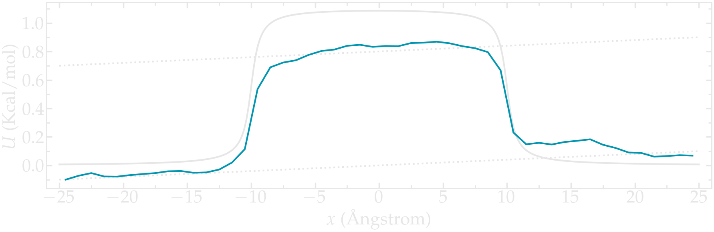
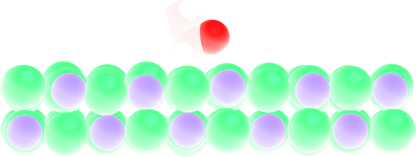
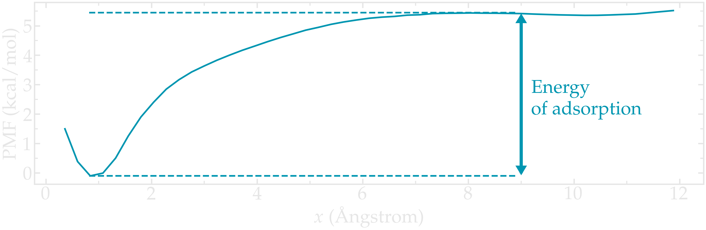

.. _umbrella-sampling-label:

Free energy calculation
***********************

.. container:: hatnote

   Sampling a free energy barrier

.. figure:: ../figures/level3/free-energy-calculation/avatar_light.webp
    :height: 250
    :alt: Lennard Jones atoms simulated with LAMMPS
    :class: only-light
    :align: right

.. figure:: ../figures/level3/free-energy-calculation/avatar_dark.webp
    :height: 250
    :alt: Lennard Jones atoms simulated with LAMMPS
    :class: only-dark
    :align: right

..  container:: justify

    The objective of this tutorial is to measure a free
    energy profile of particles across a barrier potential
    using two methods; free sampling and umbrella sampling.
    
..  container:: justify

    For the sake of simplicity and in order to reduce the computation time, the
    barrier potential will be imposed artificially to the atoms.
    The procedure is valid for more complex
    systems, and can be adapted to many other situations, for instance 
    for measuring adsorption barrier near a wall, or for calculating translocation
    barrier through a membrane.

.. include:: ../../non-tutorials/recommand-lj.rst

.. include:: ../../non-tutorials/needhelp.rst

.. include:: ../../non-tutorials/2Aug2023.rst

.. admonition:: What is free energy
    :class: info

    The *free energy* refers to the potential energy of a system that
    is available to perform work. In molecular simulations, it is
    common to calculate free energy differences between different states
    or conformations of a molecular system. This can be useful in understanding
    the thermodynamics of a system, predicting reaction pathways, and
    determining the stability of different molecular configurations.

Method 1: Free sampling
=======================

..  container:: justify

    The most direct way to calculate a free energy profile is to extract
    the partition function from a classic (unbiased) molecular
    dynamics simulation, and then to estimate the Gibbs free
    energy using 
    
.. math::
    
    \Delta G = -RT \ln(p/p_0),
    
..  container:: justify

    where :math:`\Delta G` is the free energy difference,
    :math:`R` the gas constant,
    :math:`T` the temperature, 
    :math:`p` the pressure,
    and :math:`p_0` the reference pressure.
    As an illustration, let us apply this method to an
    extremely simple configuration that consists in a few
    particles diffusing in a box in presence of a
    position-dependent repealing force that makes the centre
    of the box a relatively unfavourable area to explore.

Basic LAMMPS parameters
-----------------------

..  container:: justify

    Create a folder named *FreeSampling/*, and create an input script
    named *input.lammps* in it. Copy the following lines into it:

..  code-block:: lammps

    variable sigma equal 3.405 # Angstrom
    variable epsilon equal 0.238 # Kcal/mol
    variable U0 equal 1.5*${epsilon} # Kcal/mol
    variable dlt equal 1.0 # Angstrom
    variable x0 equal 10.0  # Angstrom

    units real
    atom_style atomic
    pair_style lj/cut 3.822
    pair_modify shift yes
    boundary p p p

..  container:: justify

    Here, we start by defining variables for the Lennard-Jones
    interaction :math:`\sigma` and :math:`\epsilon` and for
    the repulsive potential :math:`U (x)`: :math:`U_0`, :math:`\delta`, and :math:`x_0`, 
    see the analytical expression below.

..  container:: justify

    The value of 3.822 for the cut off was chosen to 
    create a WCA, purely repulsive, potential. It was calculated
    as :math:`2^{1/6} \times 3.405` where
    :math:`3.405 = \sigma`.

..  container:: justify

    The system of unit '*real*, for which energy is in kcal/mol, distance in Ångstrom,
    time in femtosecond, has been chosen for practical reason:
    the WHAM algorithm used in the second
    part of the tutorial automatically assumes the energy to
    be in kcal/mol. Atoms will interact through a
    Lennard-Jones potential with a cut-off equal to 
    :math:`\sigma \times 2 ^ {1/6}` (i.e. a WCA repulsive
    potential). The potential is shifted to be equal to 0 at
    the cut-off using the *pair_modify*.

System creation and settings
----------------------------

..  container:: justify

    Let us define the simulation block and randomly add atoms
    by adding the following lines to *input.lammps*:

..  code-block:: lammps

    region myreg block -25 25 -5 5 -25 25
    create_box 1 myreg
    create_atoms 1 random 60 341341 myreg overlap 1.0 maxtry 50

    mass * 39.95
    pair_coeff * * ${epsilon} ${sigma}
    neigh_modify every 1 delay 4 check yes

..  container:: justify

    Here, I am using the argon's values of the
    Lennard-Jones parameters :math:`\sigma` and
    :math:`\epsilon`, as well as
    the mass :math:`m = 39.95` grams/mole. 
    
..  container:: justify

    In the previous subsection, the
    variables :math:`U_0`,
    :math:`\delta`, and
    :math:`x_0` were defined. They are used to create
    the repulsive potential restricting the atoms to
    explore the center of the box: 

.. math::

    U(x) = U_0 \left[ \arctan \left( \dfrac{x+x_0}{\delta} \right) - \arctan \left(\dfrac{x-x_0}{\delta} \right) \right]. 
    
..  container:: justify

    From the derivative of the
    potential with respect to :math:`x`, we obtain the expression
    for the force that will be imposed to the atoms:

.. math::

    F(x)= \dfrac{U_0}{\delta} \left[ \dfrac{1}{(x-x_0)^2/\delta^2+1} - \dfrac{1}{(x+x_0)^2/\delta^2+1} \right].

..  container:: justify

    The potential and force along the :math:`x`
    axis resemble:

.. figure:: ../figures/level3/free-energy-calculation/potential-light.png
   :alt: Imposed potential
   :class: only-light

.. figure:: ../figures/level3/free-energy-calculation/potential-dark.png
   :alt: Averaged density profile
   :class: only-dark

..  container:: figurelegend

    Figure: a) Potential :math:`U (x)`. b) force :math:`F (x)` (bottom) imposed to the atoms.

**Energy minimization and equilibration**

..  container:: justify

    Let us apply energy minimization to the system,
    and then impose the force :math:`F(x)` to all of
    the atoms in the simulation using the *addforce* command.
    Add the following lines to *input.lammps*:

..  code-block:: lammps

    minimize 1e-4 1e-6 100 1000
    reset_timestep 0

    variable U atom ${U0}*atan((x+${x0})/${dlt}) &
        -${U0}*atan((x-${x0})/${dlt})
    variable F atom ${U0}/((x-${x0})^2/${dlt}^2+1)/${dlt} &
        -${U0}/((x+${x0})^2/${dlt}^2+1)/${dlt}
    fix myadf all addforce v_F 0.0 0.0 energy v_U

..  container:: justify

    Finally, let us combine the *fix nve* with a *Langevin*
    thermostat and run a molecular dynamics simulation. With
    these two commands, the MD simulation is effectively in the
    NVT ensemble: constant number of atoms :math:`N`, constant
    volume :math:`V`, and constant temperature :math:`T`. Let us
    perform an equilibration of 500000 steps in total,
    using a timestep of :math:`2\,\text{fs}`
    (i.e. a total duration of :math:`1\,\text{ns}`).
    
..  container:: justify
    
    To make sure that :math:`1\,\text{ns}` is long enough, let us
    record the evolution of the number of atoms in the central
    (energetically unfavorable) region called *mymes*:

..  code-block:: lammps

    fix mynve all nve
    fix mylgv all langevin 119.8 119.8 50 1530917

    region mymes block -${x0} ${x0} INF INF INF INF 
    variable n_center equal count(all,mymes)
    fix myat all ave/time 10 50 500 v_n_center file density_evolution.dat

    timestep 2.0
    thermo 10000
    run 500000

Run and data acquisition
------------------------

..  container:: justify

    Finally, let us record the density profile of the atoms
    along the :math:`x` axis using the *ave/chunk* command. A
    total of 10 density profiles will be printed. The step count is
    reset to 0 to synchronize with the output times of
    *fix density/number*, and the *fix myat* is canceled (it has to be
    canceled before a reset time):

..  code-block:: lammps

    unfix myat
    reset_timestep 0

    compute cc1 all chunk/atom bin/1d x 0.0 1.0
    fix myac all ave/chunk 10 400000 4000000 &
        cc1 density/number file density_profile_8ns.dat
    dump mydmp all atom 200000 dump.lammpstrj

    thermo 100000
    run 4000000

..  container:: justify

    This simulation with a total duration of :math:`9\,\text{ns}` needs a few
    minutes to complete. Feel free to increase the 
    duration of the last run for smoother results.

.. figure:: ../figures/level3/free-energy-calculation/system-light.png
   :alt: Lennard jones atoms simulated with LAMMPS MD code
   :class: only-light

.. figure:: ../figures/level3/free-energy-calculation/system-dark.png
   :alt: Lennard jones atoms simulated with LAMMPS MD code
   :class: only-dark

..  container:: figurelegend

    Figure: Notice that the density of atoms is lower in the central
    part of the box, due to the additional force :math:`F (x)`.

Data analysis
--------------

..  container:: justify

    First, let us make sure that the initial equilibration of :math:`1\,\text{ns}`
    is long enough by looking at the *density_evolution.dat* file.

.. figure:: ../figures/level3/free-energy-calculation/density_evolution-light.png
   :alt: Number of particle in the central region as a function of time
   :class: only-light

.. figure:: ../figures/level3/free-energy-calculation/density_evolution-dark.png
   :alt: Number of particle in the central region as a function of time
   :class: only-dark

..  container:: figurelegend

    Figure: Evolution of the number of atoms in the central region during equilibration. 
   
..  container:: justify

    Here, we can clearly see that the number of atoms in the
    central region, :math:`n_\mathrm{central}`, evolves near its
    equilibrium value (which is close to 0) after about :math:`0.1\,\text{ns}`.

..  container:: justify

    One can also have a look at the density profile, which shows that the density in the
    center of the box is about two orders of magnitude lower than inside
    the reservoir.

.. figure:: ../figures/level3/free-energy-calculation/density_profile-light.png
   :alt: Averaged density profile
   :class: only-light

.. figure:: ../figures/level3/free-energy-calculation/density_profile-dark.png
   :alt: Averaged density profile
   :class: only-dark

..  container:: figurelegend

    Figure: Averaged density profiles for the :math:`8\,\text{ns}` run. 
    The value for the reference density :math:`\rho_\text{bulk} = 0.0033`
    was estimated from the raw density profiles.

..  container:: justify

    Then, let us plot :math:`-R T \ln(\rho/\rho_\mathrm{bulk})` and compare it
    with the imposed (reference) potential :math:`U`.

.. figure:: ../figures/level3/free-energy-calculation/freesampling-potential-light.png
   :alt: Averaged density profile
   :class: only-light

.. figure:: ../figures/level3/free-energy-calculation/freesampling-potential-dark.png
   :alt: Averaged density profile
   :class: only-dark

..  container:: figurelegend

    Figure: Calculated potential :math:`-R T \ln(\rho/\rho_\mathrm{bulk})`
    compared to imposed potential.
    The calculated potential is in blue.

..  container:: justify

    The agreement with the expected energy profile is reasonable,
    despite some noise in the central part. 

The limits of free sampling
---------------------------

..  container:: justify

    If we increase the value of :math:`U_0`, the average number of
    atoms in the central region will decrease, making it
    difficult to obtain a good resolution for the free energy
    profile. For instance, using :math:`U_0 = 10 \epsilon`,
    not a single atom crosses the central part of the simulation,
    despite the 8 ns of simulation.

.. figure:: ../figures/level3/free-energy-calculation/density_profile_large_potential-light.png
   :alt: Averaged density profile with large potential
   :class: only-light

.. figure:: ../figures/level3/free-energy-calculation/density_profile_large_potential-dark.png
   :alt: Averaged density profile  large potential
   :class: only-dark

..  container:: justify

    In that case, it is better to use the umbrella sampling method
    to extract free energy profiles, see the next section.

Method 2: Umbrella sampling
===========================

..  container:: justify

    Umbrella sampling is a biased molecular dynamics method,
    i.e. a method in which additional forces are added to the
    atoms in order to make the unfavourable states more likely
    to occur.

..  container:: justify

    Several simulations (or windows) will be performed with different parameters
    for the imposed biasing.
    
..  container:: justify

    Here, let us force one of the atom to
    explore the central region of the box. To do so,
    let us add a potential :math:`V` to one
    of the particle, and force it to move along the axis :math:`x`.
    The chosen path is called the axis of reaction. The results 
    will be analyzed using the weighted histogram
    analysis method (WHAM), which allows to remove the effect of
    the bias and eventually deduce the unbiased free energy profile.

LAMMPS input script
-------------------

..  container:: justify

    Create a new folder called *BiasedSampling/*, create a new input file 
    named *input.lammps* in it, and copy the following lines:

..  code-block:: lammps

    variable sigma equal 3.405 # Angstrom
    variable epsilon equal 0.238 # Kcal/mol
    variable U0 equal 10*${epsilon} # Kcal/mol
    variable dlt equal 0.5 # Angstrom
    variable x0 equal 5.0  # Angstrom
    variable k equal 1.5 # Kcal/mol/Angstrom^2

    units real
    atom_style atomic
    pair_style lj/cut 3.822 # 2^(1/6) * 3.405 WCA potential
    pair_modify shift yes
    boundary p p p

    region myreg block -25 25 -5 5 -25 25
    create_box 2 myreg
    create_atoms 2 single 0 0 0
    create_atoms 1 random 5 341341 myreg overlap 1.0 maxtry 50

    mass * 39.948
    pair_coeff * * ${epsilon} ${sigma}
    neigh_modify every 1 delay 4 check yes
    group topull type 2

    variable U atom ${U0}*atan((x+${x0})/${dlt}) &
        -${U0}*atan((x-${x0})/${dlt})
    variable F atom ${U0}/((x-${x0})^2/${dlt}^2+1)/${dlt} &
        -${U0}/((x+${x0})^2/${dlt}^2+1)/${dlt}
    fix pot all addforce v_F 0.0 0.0 energy v_U

    fix mynve all nve
    fix mylgv all langevin 119.8 119.8 50 1530917
    timestep 2.0
    thermo 100000
    run 500000
    reset_timestep 0

    dump mydmp all atom 1000000 dump.lammpstrj

..  container:: justify

    So far, this code resembles the one of Method 1,
    except for the additional particle of type 2. This
    particle is identical to the particles of type 1 (same
    mass and Lennard-Jones parameters), but will be exposed to the
    biasing potential.

..  container:: justify

    Let us create a loop with 50 steps, and move progressively
    the centre of the bias potential by increment of 0.1 nm.
    Add the following lines into *input.lammps*:

..  code-block:: lammps

    variable a loop 50
    label loop
    variable xdes equal ${a}-25
    variable xave equal xcm(topull,x)
    fix mytth topull spring tether ${k} ${xdes} 0 0 0
    run 200000
    fix myat1 all ave/time 10 10 100 v_xave v_xdes &
        file data-k1.5/position.${a}.dat
    run 1000000
    unfix myat1
    next a
    jump SELF loop

..  container:: justify

    A folder named *data-k1.5/* needs to be created within *BiasedSampling/*.

..  container:: justify

    The spring command serves to impose the
    additional harmonic potential with spring constant :math:`k`.
    Note that the value of :math:`k` should be chosen with care,
    if :math:`k` is too small, the particle wont follow the biasing potential
    center, if :math:`k` is too large, there will be no overlapping between the 
    different windows. See the side note named *on the choice of k* below.

..  container:: justify

    The centre of the harmonic potential :math:`x_\text{des}`
    successively takes values from -25 to 25. For each value of
    :math:`x_\text{des}`, an equilibration step of 0.4 ns is
    performed, followed by a step of 2 ns during which the
    position along :math:`x` of the particle is saved in data
    files (one data file per value of :math:`x_\text{des}`). You
    can always increase the duration of the runs for better samplings.

WHAM algorithm
--------------

..  container:: justify

    In order to generate the free energy profile from the density distribution, we are going to use
    the WHAM algorithm. 
    
..  container:: justify

    You can download it from |Grossfield| website, and compile it using: 

.. |Grossfield| raw:: html

   <a href="http://membrane.urmc.rochester.edu/?page_id=126" target="_blank">Alan Grossfield</a>

..  code-block:: bash

    cd wham
    make clean
    make

..  container:: justify

    The compilation creates an executable called *wham* that you can 
    copy in the *BiasedSampling/* folder. Alternatively, use 
    the |wham-version| I have downloaded, or try your luck with the version 
    i did precompile; |wham-precompiled|.

.. |wham-version| raw:: html

   <a href="../../../../../lammpstutorials-inputs/level3/free-energy-calculation/BiasedSampling/wham-release-2.0.11.tgz" target="_blank">version 2.0.11</a>

.. |wham-precompiled| raw:: html

   <a href="../../../../../lammpstutorials-inputs/level3/free-energy-calculation/BiasedSampling/wham" target="_blank">precompiled wham</a>

..  container:: justify

    In order to apply the WHAM algorithm to our simulation, we
    first need to create a metadata file. This file simply
    contains 
    
..  container:: justify

    - the paths to all the data files,
    - the value of :math:`x_\text{des}`,
    - and the values of :math:`k`.
    
..  container:: justify

    To generate the *metadata.txt* file, you can run this Python script
    from the *BiasedSampling/* folder:

..  code-block:: python

    import os

    k=1.5 
    folder='data-k1.5/'

    f = open("metadata.dat", "w")
    for n in range(-50,50):
        datafile=folder+'position.'+str(n)+'.dat'
        if os.path.exists(datafile):
            # read the imposed position is the expected one
            with open(datafile) as g:
                _ = g.readline()
                _ = g.readline()
                firstline = g.readline()
            imposed_position = firstline.split(' ')[-1][:-1]
            # write one file per file
            f.write(datafile+' '+str(imposed_position)+' '+str(k)+'\n')
    f.close()

..  container:: justify

    Here :math:`k` is in kcal/mol.
    The generated file named *metadata.dat* looks like that:

..  code-block:: bash

    ./data-k1.5/position.1.dat -24 1.5
    ./data-k1.5/position.2.dat -23 1.5
    ./data-k1.5/position.3.dat -22 1.5
    (...)
    ./data-k1.5/position.48.dat 23 1.5
    ./data-k1.5/position.49.dat 24 1.5
    ./data-k1.5/position.50.dat 25 1.5

..  container:: justify

    Alternatively, you can download this |download_metadata| file.
    Then, simply run the following command in the terminal:

.. |download_metadata| raw:: html

   <a href="../../../../../lammpstutorials-inputs/level3/free-energy-calculation/BiasedSampling/metadata.dat" target="_blank">metadata.dat</a>

..  code-block:: bash

    ./wham -25 25 50 1e-8 119.8 0 metadata.dat PMF.dat

..  container:: justify

    where -25 and 25 are the boundaries, 50 the number of bins,
    1e-8 the tolerance, and 119.8 the temperature. A file named
    PMF.dat has been created, and contains the free energy
    profile in Kcal/mol.

**Results**

..  container:: justify

    Again, one can compare the result of the PMF with the imposed potential :math:`U`,
    which shows that the agreement is excellent.

.. figure:: ../figures/level3/free-energy-calculation/freeenergy-light.png
    :alt: Result of the umbrella sampling
    :class: only-light

.. figure:: ../figures/level3/free-energy-calculation/freeenergy-dark.png
    :alt: Result of the umbrella sampling
    :class: only-dark

..  container:: figurelegend

    Figure: Calculated potential using umbrella sampling compared to
    the imposed potential. The calculated potential is in blue.

..  container:: justify

    We can see that the agreement is quite good despite the very short calculation time
    and the very high value for the energy barrier. Obtaining the same 
    results with Free Sampling would require to perform extremely long
    and costly simulations.

.. include:: ../../non-tutorials/accessfile.rst

Side note: on the choice of k
-----------------------------

..  container:: justify

    As already stated, one difficult part of umbrella sampling is to choose the value of :math:`k`.
    Ideally, you want the biasing potential to be strong enough to force
    the chosen atom to move along the axis, and you also want the
    fluctuations of the atom position to be large enough to
    have some overlap in the density probability of two
    neighbor positions. Here, 3 different values of :math:`k` are being tested.

.. figure:: ../figures/level3/free-energy-calculation/overlap-light.png
    :alt: Averaged density profile
    :class: only-light

..  container:: figurelegend

    Figure: Density probability for each run with :math:`k = 0.15\,\text{Kcal}/\text{mol}/Å^2` (a),
    :math:`k = 1.5\,\text{Kcal}/\text{mol}/Å^2` (b),
    and :math:`k = 15\,\text{Kcal}/\text{mol}/Å^2` (c).
    
..  container:: justify

    If :math:`k` is too small, the biasing potential is too weak to force the particle to explores the 
    region of interest, making it impossible to reconstruct the PMF.

..  container:: justify

    If :math:`k` is too large, the biasing potential is too large 
    compared to the potential one want to probe, which reduces the 
    sensitivity of the method.

Going further with exercises
============================

.. include:: ../../non-tutorials/link-to-solutions.rst

The binary fluid that wont mix
------------------------------

..  container:: justify

    **1 - Create the system**

    Create a molecular simulation with two species of respective types 1 and 2.
    Apply different potentials :math:`U1` and :math:`U2` on particles of types 1 and 2, respectively,
    so that particles of type 1 are excluded from the center of the box, while at the same time particles
    of type 2 are excluded from the rest of the box.

.. figure:: ../figures/level3/free-energy-calculation/exercice2-light.png
    :alt: Particles of type 1 and 2 separated by two different potentials
    :class: only-light

.. figure:: ../figures/level3/free-energy-calculation/exercice2-dark.png
    :alt: Particles of type 1 and 2 separated by two different potentials
    :class: only-dark

..  container:: figurelegend

    Figure: Particles of type 1 and 2 separated by two different potentials.

..  container:: justify

    **2 - Measure the PMFs**

    Using the same protocole as the one used in the tutorial
    (i.e. umbrella sampling with the wham algorithm),
    extract the PMF for each particle type.

.. figure:: ../figures/level3/free-energy-calculation/exercice-binary-light.png
    :alt: PMF in the presence of binary species
    :class: only-light

.. figure:: ../figures/level3/free-energy-calculation/exercice-binary-dark.png
    :alt: PMF in the presence of binary species
    :class: only-dark

..  container:: figurelegend

    Figure: PMFs calculated for both atom types. 

Particles under convection
--------------------------

..  container:: justify

    Use a similar simulation as the one from the tutorial,
    with a repulsive potential in the center
    of the box. Add an additional forcing to the particles
    and force them to flow in the :math:`x` direction.

..  container:: justify

    Re-measure the potential in presence of the flow, and observe the difference
    with the reference case in absence of flow.

.. figure:: ../figures/level3/free-energy-calculation/exercice-convection-light.png
    :alt: PMF in the presence of forcing
    :class: only-light

..  container:: figurelegend

    Figure: PMF calculated in the presence of a net forcing inducing
    the convection of the particles from left to right. 

Surface adsorption of a molecule
--------------------------------

..  container:: justify

    Apply umbrella sampling to calculate the free energy profile
    of ethanol in the direction normal to a crystal solid surface
    (here made of sodium chloride). Find the |topology-ethanol|
    and |parameter-ethanol|.

.. |topology-ethanol| raw:: html

   <a href="../../../../../lammpstutorials-inputs/level3/free-energy-calculation/Exercises/MoleculeAdsorption/init.data" target="_blank">topology files</a>

.. |parameter-ethanol| raw:: html

   <a href="../../../../../lammpstutorials-inputs/level3/free-energy-calculation/Exercises/MoleculeAdsorption/PARM.lammps" target="_blank">parameter file</a>

..  container:: justify

    Use the following lines for starting the *input.lammps*:

..  code-block:: lammps

    units real # style of units (A, fs, Kcal/mol)
    atom_style full # molecular + charge
    bond_style harmonic
    angle_style harmonic
    dihedral_style harmonic
    boundary p p p # periodic boundary conditions
    pair_style lj/cut/coul/long 10 # cut-off 1 nm
    kspace_style pppm 1.0e-4
    pair_modify mix arithmetic tail yes

..  container:: justify

    The PMF normal to a solid wall serves to indicate the free energy of adsorption,
    which can be calculated from the difference between the PMF far
    from the surface, and the PMF at the wall.

..  container:: figurelegend

    Figure: A single ethanol molecule next to a crystal NaCl(100) wall.

..  container:: justify

    The PMF shows a mimina near the solid surface, which indicates a good
    affinity between the wall and the molecule.

.. figure:: ../figures/level3/free-energy-calculation/exercice-ethanol-light.png
    :alt: PMF for ethanol molecule next to NaCl
    :class: only-light

..  container:: figurelegend

    Figure: PMF for a single ethanol molecule next to a NaCl
    solid surface. The position of the wall is in :math:`x=0`.
    The arrow highlight the difference between the energy of the 
    molecule when adsorbed to the solid surface, and
    the energy far from the surface. This difference corresponds to the
    free energy of adsorption.

..  container:: justify

    Alternatively to using ethanol, feel free to download the molecule of your choice, for 
    instance from the Automated Topology Builder (ATB). Make your life simpler
    by choosing a small molecule like CO2.
