.. _reactive-silicon-dioxide-label:

Reactive silicon dioxide
************************

.. container:: hatnote

   Simulating a chemically reactive structure

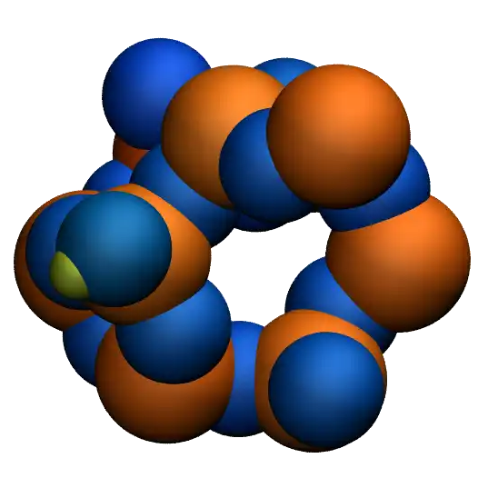

.. figure:: ../figures/level3/reactive-silicon-dioxide/SiO_gif_dark.webp
    :height: 250
    :alt: Figure showing silicon dioxide structure with colored charges as simulated with lammps and reaxff
    :class: only-dark
    :align: right

..  container:: justify

    The objective of this tutorial is to use a molecular
    dynamics system made of silicon dioxide (SiO2), and deform 
    it until it breaks. The reactive force field *reaxff* is used, and 
    a particular attention is given to the evolution of the charges
    of the atoms during the deformation of the structure. 

..  container:: justify

    The chemical reactions occurring due to the deformation
    are tracked and discussed.

.. include:: ../../contact/recommand-lj.rst

.. include:: ../../contact/needhelp.rst

.. include:: ../../contact/2Aug2023.rst

Prepare and relax
=================

..  container:: justify

    Create a folder, name it *RelaxSilica/*, and |download_silica_data|
    the initial topology of a small amorphous silica structure.
    The system was created by temperature annealing using another force field 
    (|download_SiO.1990.vashishta|), therefore the structure is slightly
    different to what is expected from the reaxff force field. 
    For instance, the average bond lengths, angles, and charges 
    are likely to be different, and the structure needs 
    to be relaxed again using reaxff. 

..  container:: justify

    In case you are interested in the input creation, the input file
    used for creating the initial topology is available
    |lammps_input_creating|.

.. |download_silica_data| raw:: html

   <a href="../../../../../inputs/level3/reactive-silicon-dioxide/RelaxSilica/silica.data" target="_blank">download</a>

.. |download_SiO.1990.vashishta| raw:: html

   <a href="../../../../../inputs/level3/reactive-silicon-dioxide/CreateSilica/SiO.1990.vashishta" target="_blank">vashishta</a>

.. |lammps_input_creating| raw:: html

   <a href="../../../../../inputs/level3/reactive-silicon-dioxide/CreateSilica/input.lammps" target="_blank">here</a>

..  container:: justify

    If you open the *silica.data* file, you can see 
    by looking at the Atoms section that
    all silicon atoms have the same charge :math:`q = 1.1\,\text{e}`,
    and all oxygen atoms the charge :math:`q = -0.55\,\text{e}`.
    This is common with classical force field, and will change once
    reaxff is used. Let us keep that in mind for now.

..  container:: justify

    The first step we need to perform here is to relax
    the structure, which we are gonna do using molecular
    dynamics. To make sure that the system equilibrates
    nicely, we will track the changes over time.

..  container:: justify

    Create an input file called *input.lammps* in *RelaxSilica/*,
    and copy the following lines in it: 

..  code-block:: lammps

    units real
    atom_style full

    read_data silica.data

    mass 1 28.0855 # Si
    mass 2 15.999 # O

..  container:: justify

    So far, the input is very similar to what was seen
    in the previous tutorials. Some basic parameters are
    defined (*units*, *atom_style* and *masses*), and 
    the *.data* file is imported by the *read_data* command.
    Now let us enter 3 crucial lines in the *input.lammps* file:

..  code-block:: lammps

    pair_style reaxff NULL safezone 3.0 mincap 150
    pair_coeff * * reaxCHOFe.ff Si O
    fix myqeq all qeq/reaxff 1 0.0 10.0 1.0e-6 reaxff maxiter 400

..  container:: justify

    Here, the reaxff *pair_style* is used with no control file,
    and the *safezone* and *mincap* keywords have been added
    to avoid memory allocation issue. If not there, the segmentation
    faults and bondchk failed errors sometimes occur.

..  container:: justify

    The *pair_coeff* uses
    the |reaxCHOFe| file which is assumed to be saved within *RelaxSilica/*.
    For consistency, the atoms of type 1 are set as silicon (Si),
    and the atoms of type 2 as oxygen (O).

..  container:: justify

    Finally, the *fix qeq/reaxff* is used to perform charge equilibration. The charge
    equilibration occurs at every step. The values 0 and 10.0
    are the low and the high cutoffs, respectively, and :math:`1.0 \text{e}-6` is a
    tolerance. Finally, *maxiter* sets a upper limit to the number of attempt to
    equilibrate the charge. 

.. admonition:: Note
    :class: info

    If the charge does not
    properly equilibrate despite the 400 attempts, a warning will appear. Such warning
    are likely to appear at the beginning of the simulation if the initial charges
    are too far from the equilibrium values.

.. |reaxCHOFe| raw:: html

   <a href="../../../../../inputs/level3/reactive-silicon-dioxide/RelaxSilica/reaxCHOFe.ff" target="_blank">reaxCHOFe.ff</a>

..  container:: justify

    Then, let us add some commands to the *input.lammps* file 
    to measure the evolution of the charges during the simulation:

..  code-block:: lammps

    group grpSi type 1
    group grpO type 2
    variable totqSi equal charge(grpSi)
    variable totqO equal charge(grpO)
    variable nSi equal count(grpSi)
    variable nO equal count(grpO)
    variable qSi equal v_totqSi/${nSi}
    variable qO equal v_totqO/${nO}
    
..  container:: justify

    Let us also print the charge in the *.log* file by using *thermo_style*,
    and create a *.lammpstrj* file for visualization.
    Add the following lines to the *input.lammps*:

..  code-block:: lammps

    dump dmp all custom 100 dump.lammpstrj id type q x y z
    thermo 5
    thermo_style custom step temp etotal press vol v_qSi v_qO

..  container:: justify

    Let us also use the *fix reaxff/species* to evaluate what
    species are present within the simulation. It will
    be useful later, when the system is deformed:

..  code-block:: lammps

    fix myspec all reaxff/species 5 1 5 species.log element Si O

..  container:: justify

    Here, the information will be printed every 5 steps in a
    file named *species.log*.

..  container:: justify

    Let us perform a very short run using anisotropic NPT command
    and relax the density of the system. 

..  code-block:: lammps

    velocity all create 300.0 3482028
    fix mynpt all npt temp 300.0 300.0 100 aniso 1.0 1.0 1000
    timestep 0.5

    run 5000

..  container:: justify

    Run the *input.lammps* file using LAMMPS. As can be seen from *species.log*,
    only one species is detected, called *Si192O384*, which is the entire system.

..  container:: justify

    As the simulation progresses, you can see that the charges of the atoms are fluctuating
    since the charge of every individual atom is adjusting to its local environnement.

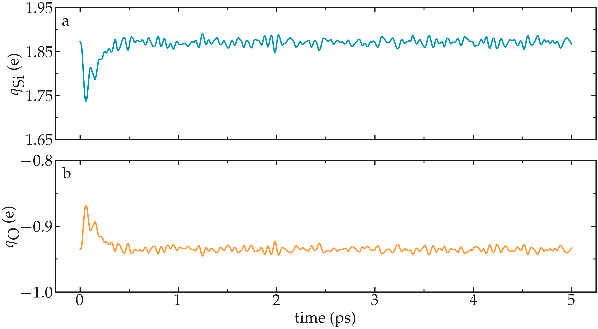

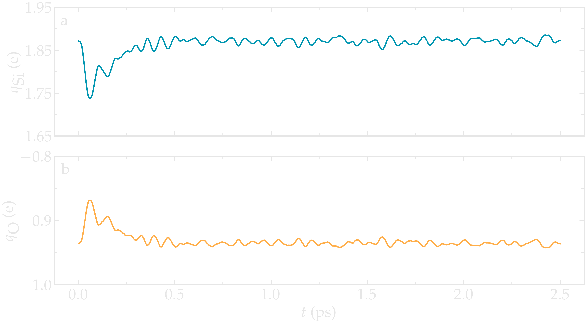

..  container:: figurelegend

    Figure: Average charge per atom of the silicon (a) and oxygen (b) atoms during equilibration.

..  container:: justify

    One can see that the charges of the atoms are strongly fluctuating
    at the beginning of the simulation. This early fluctuation correlates
    with a rapid volume change of the box, during which one can guess 
    that the inter atomic distances are also quickly changing.

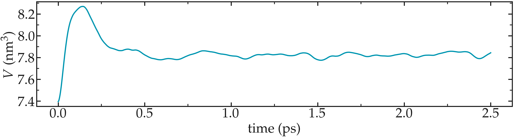

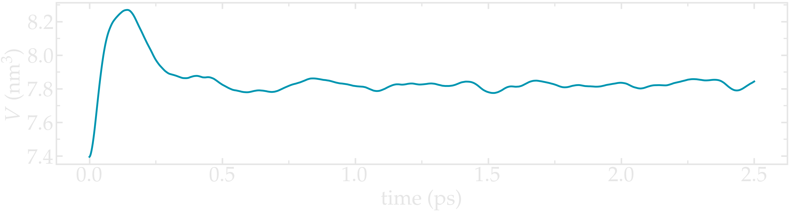

..  container:: figurelegend

    Figure: Volume of the system as a function of time.

..  container:: justify

    Since each atom has a charge that depends on its local environnement,
    the charge values are expected to be different for every atom in the system. We can plot 
    the charge distribution :math:`P(q)`, using the charge values printed in
    the *.lammptrj* file. To do so, a custom *Python* script 
    was written, you can download the notebook by clicking |plot_distribution|. 

.. |plot_distribution| raw:: html

   <a href="../../../../../inputs/level3/reactive-silicon-dioxide/RelaxSilica/plot_distribution.ipynb" target="_blank">here</a>

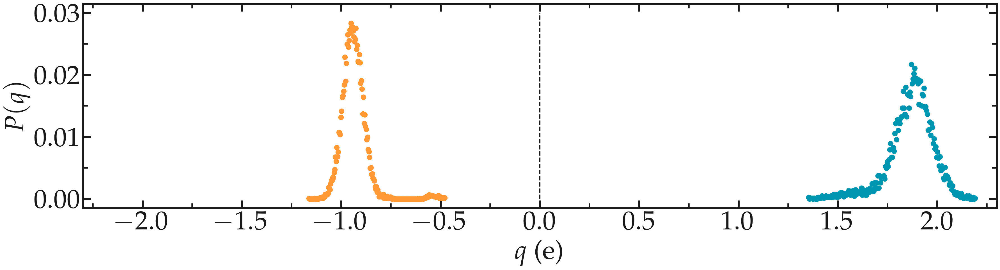

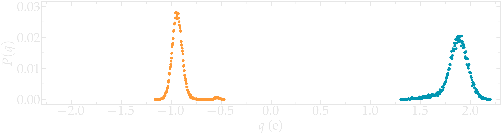

..  container:: figurelegend

    Figure: Probability distribution of charge of silicon (positive, blue)
    and oxygen (negative, orange) atoms during equilibration.

..  container:: justify

    Using VMD and coloring the atoms by their charges, one can see that 
    the atoms with the extreme-most charges are located at defects in the 
    amorphous structure (here at the positions of the dandling oxygen groups).

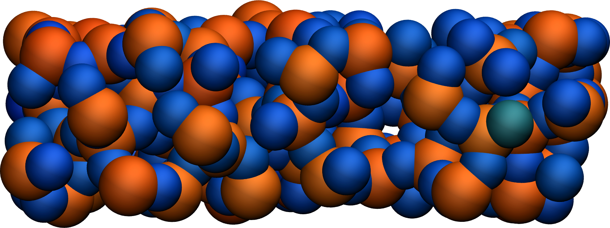

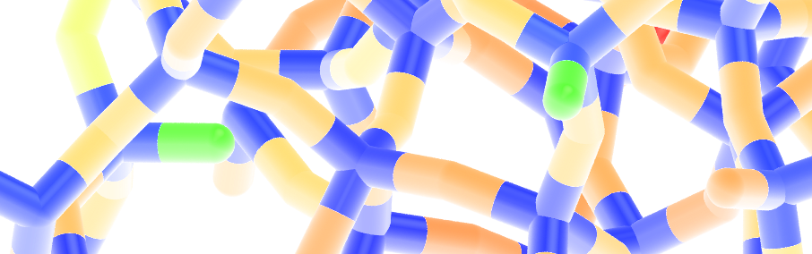

..  container:: figurelegend

    Figure: Amorphous silica colored by charges using VMD. Dandling oxygen groups appear in green.
    To color the atoms by their charge in VMD, use *Charge* as coloring method in the 
    representation windows, and then tune the *Color scale* in the *Color control windows*.

.. include:: ../../contact/supportme.rst

Deform the structure
====================

..  container:: justify

    Let us apply a deformation to the structure in order to
    force some :math:`\text{Si}-\text{O}` bonds to break and/or re-assemble. 

    Next to *RelaxSilica/*, create a folder, call it *Deform/* and create a
    file named *input.lammps* in it. Copy the same lines
    as previously in input.lammps*:

..  code-block:: lammps

    units real
    atom_style full

    read_data ../RelaxSilica/silica-relaxed.data

    mass 1 28.0855 # Si
    mass 2 15.999 # O

    pair_style reaxff NULL safezone 3.0 mincap 150
    pair_coeff * * ../RelaxSilica/reaxCHOFe.ff Si O
    fix myqeq all qeq/reaxff 1 0.0 10.0 1.0e-6 reaxff maxiter 400

..  container:: justify

    The only differences with the previous *input.lammps* file
    are the paths to the *.data* and *.ff*
    files located within *RelaxSilica/*.
    Copy the following lines as well:

..  code-block:: lammps

    group grpSi type 1
    group grpO type 2
    variable totqSi equal charge(grpSi)
    variable totqO equal charge(grpO)
    variable nSi equal count(grpSi)
    variable nO equal count(grpO)
    variable qSi equal v_totqSi/${nSi}
    variable qO equal v_totqO/${nO}

    dump dmp all custom 100 dump.lammpstrj id type q x y z
    thermo 5
    thermo_style custom step temp etotal press vol v_qSi v_qO
    fix myspec all reaxff/species 5 1 5 species.log element Si O

..  container:: justify

    Then, let us use *fix nvt* instead of *fix npt* to apply a
    thermostat, but no barostat because the box deformations
    will be imposed.

..  code-block:: lammps

    fix mynvt all nvt temp 300.0 300.0 100
    timestep 0.5

..  container:: justify

    Then, let us use run for 5000 steps,
    then apply the *fix deform* for elongating
    progressively the box along *x*. Let us apply 
    fix deform during 25000 steps.
    Add the following line to *input.lammps*:

..  code-block:: lammps

    run 5000

    fix mydef all deform 1 x erate 5e-5

    run 25000

    write_data silica-deformed.data

..  container:: justify

    During the deformation, the charges progressively change until the structure eventually
    breaks up. After the structure breaks, the charges equilibrate near new 
    mean values that differ from the starting charges. The difference between 
    the initial and the final charge can be explained by
    presence of a new solid/vacuum interface (surface atoms have different charges
    compared to bulk atoms).

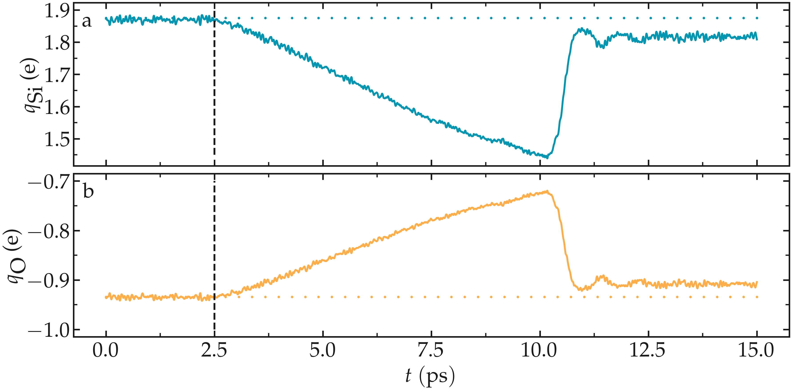

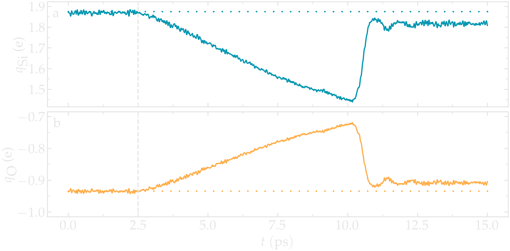

..  container:: figurelegend

    Figure: Average charge per atom of the silicon (a) and oxygen (b).
    The vertical dashed lines marks the beginning of the deformation.

..  container:: justify

    There is also a strong increase in temperature during the rupture of the
    material.

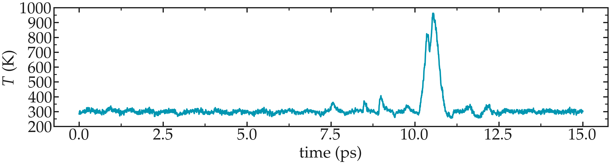

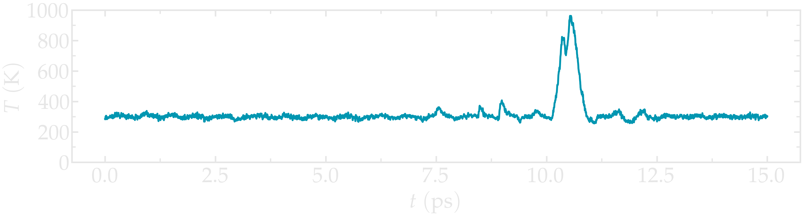

..  container:: figurelegend

    Figure: Temperature of the system over time.

..  container:: justify

    At the end of the deformation, one can visualize the broken material using VMD.
    Notice the different charge of the atoms located near the interface, compared to the 
    atoms located in the bulk of the material.

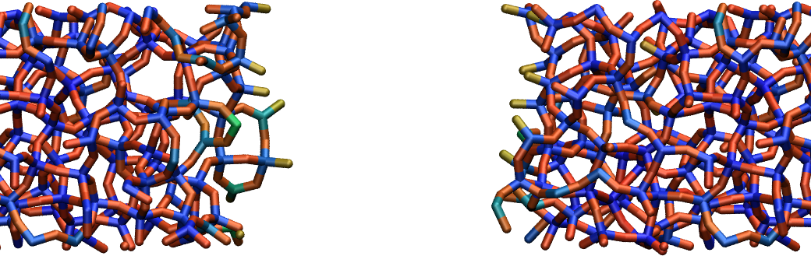

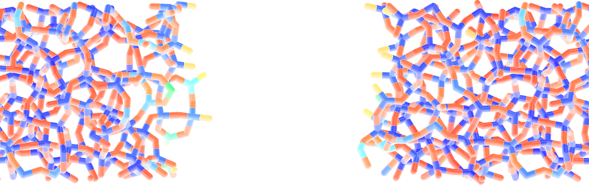

..  container:: figurelegend

    Figure: Amorphous silicon oxide after deformation. The atoms are colored by
    charges using VMD.

..  container:: justify

    One can have a look at the charge distribution after deformation,
    as well as during the deformation.

.. figure:: ../figures/level3/reactive-silicon-dioxide/deformed-distribution-charge-light.png
    :alt: Distribution charge of silica and oxygen during equilibration with reaxff
    :class: only-light

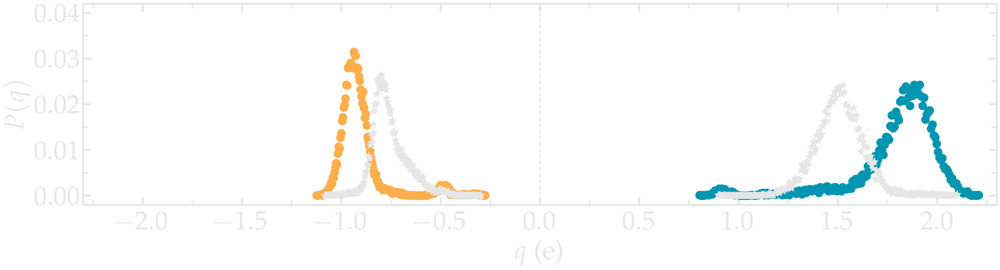

..  container:: figurelegend

    Figure: Distribution of charge of silicon (positive, blue) and oxygen (negative, orange)
    after deformation. The stars correspond to the charge distribution during deformation. 

..  container:: justify

    The final charge distribution slightly differs from the previously calculated,
    which was to be expected as the material was broken.
    In my case, no need species was formed during the simulation,
    as can be seen from the *species.log* file:

..  code-block:: lammps

    #  Timestep    No_Moles    No_Specs   Si192O384
            5           1           1           1
    (...)
    #  Timestep    No_Moles    No_Specs   Si192O384
        30000           1           1           1

..  container:: justify

    Sometimes, :math:`\text{O}_2` molecules are formed during the
    deformation. If this is the case, the species.log* file will look like:

..  code-block:: lammps

    #  Timestep    No_Moles    No_Specs   Si192O384
              5           1           1           1
    (...)
    #  Timestep    No_Moles    No_Specs   Si192O382          O2
          30000           1           1           1           1

.. include:: ../../contact/accessfile.rst

Going further with exercises
============================

.. container:: justify

    A solution for each exercise is provided here: :ref:`solutions-label`. 

Add O2 molecules
----------------

..  container:: justify

    Add :math:`\text{O}_2` molecules to the previously
    equilibrated structure. Equilibrate it again, and
    extract the charge density profile along the :math:`x` axis. 

..  container:: justify

    Use the following molecule template named *O2.mol*:

..  code-block:: lammps

    2 atoms

    Coords

    1 -0.6 0 0
    2 0.6 0 0

    Types

    1 2
    2 2   

    Charges 

    1 0.0
    2 0.0

..  container:: justify

    Here, the :math:`\text{O}_2` molecule is simply made of 2 oxygen atoms that are not 
    connected by any bond.

.. figure:: ../figures/level3/reactive-silicon-dioxide/O2_light.png
    :alt: Silicon oxide with additional O2 molecules
    :class: only-light

.. figure:: ../figures/level3/reactive-silicon-dioxide/O2_dark.png
    :alt: Silicon oxide with additional O2 molecules
    :class: only-dark

..  container:: figurelegend

    Figure: Deformed structure with some :math:`\text{O}_2` molecules

Decorate dandling oxygens
-------------------------

..  container:: justify

    Under ambient conditions, dandling oxygen are typically terminated by hydrogen atoms. 
    Improve the current structure by decorating some of the dandling oxygen atoms with
    hydrogen atoms. 

.. figure:: ../figures/level3/reactive-silicon-dioxide/exercice-light.png
    :alt: Silicon oxide decorated with hydrogens
    :class: only-light

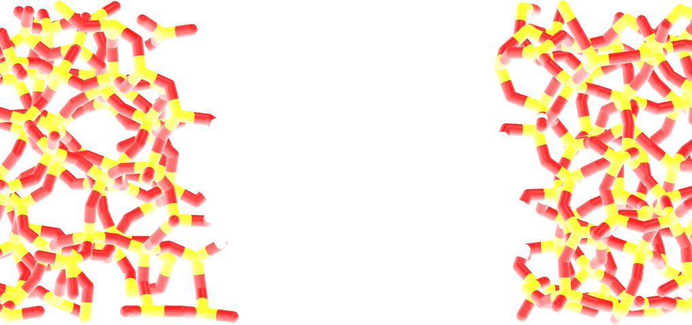

..  container:: figurelegend

    Figure: Hydrogen atoms are in white, oxygen in red, and silicon in yellow.
