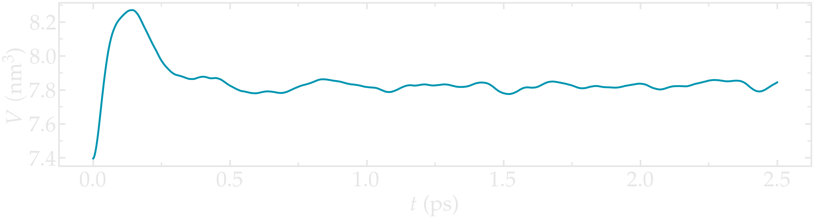
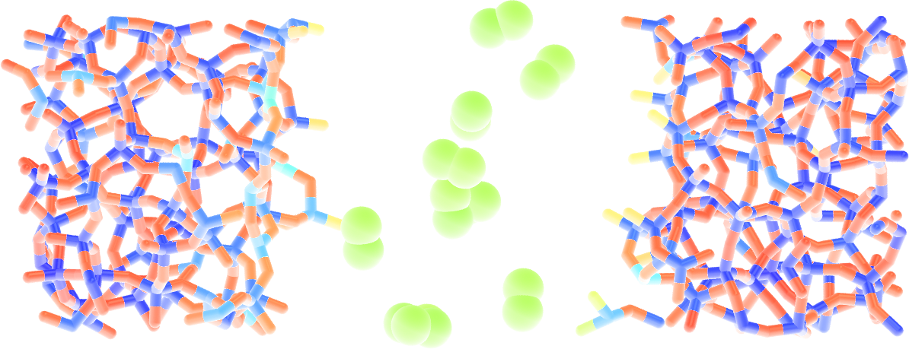
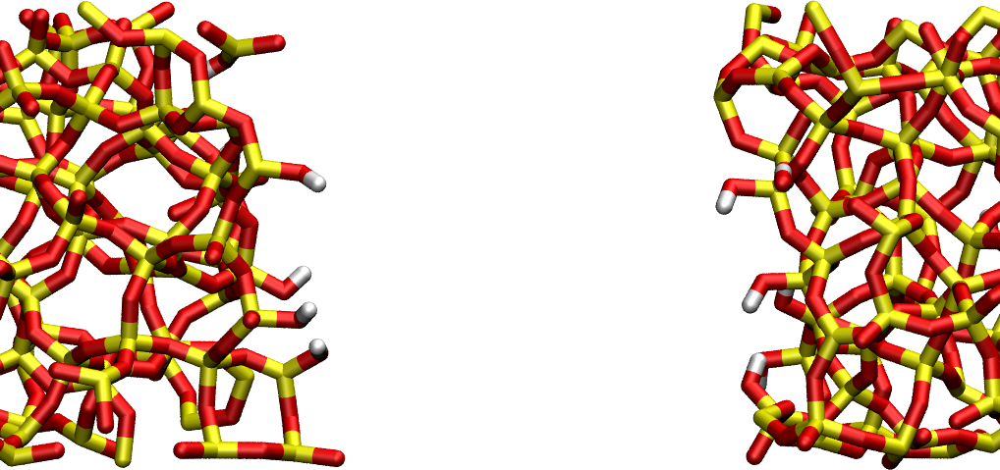

.. _reactive-silicon-dioxide-label:

Reactive silicon dioxide
************************

.. container:: hatnote

   Simulating a chemically reactive structure

.. figure:: ../figures/level3/reactive-silicon-dioxide/SiO_gif_dark.webp
    :height: 250
    :alt: Figure showing silicon dioxide structure with colored charges as simulated with lammps and reaxff
    :class: only-dark
    :align: right

..  container:: justify

    The objective of this tutorial is to use a molecular
    dynamics system made of silicon dioxide (SiO2), and deform 
    it until it breaks. The reactive force field *reaxff* is used, and 
    a particular attention is given to the evolution of the charges
    of the atoms during the deformation of the structure. 

..  container:: justify

    The chemical reactions occurring due to the deformation
    are tracked and discussed.

.. include:: ../../contact/recommand-lj.rst

.. include:: ../../contact/needhelp.rst

.. include:: ../../contact/2Aug2023.rst

Relax the structure
===================

..  container:: justify

    Create a folder, name it *RelaxSilica/*, and |download_silica_data|
    the initial topology of a small amorphous silica structure.
    The system was created by temperature annealing using another force field 
    (|download_SiO.1990.vashishta|), therefore the structure is slightly
    different to what is expected from the reaxff force field. 
    For instance, the average bond lengths, angles, and charges 
    are likely to be different, and the structure needs 
    to be relaxed again using reaxff. 

..  container:: justify

    In case you are interested in the input creation, the input file
    used for creating the initial topology is available
    |lammps_input_creating|.

.. |download_silica_data| raw:: html

   <a href="../../../../../inputs/level3/reactive-silicon-dioxide/RelaxSilica/silica.data" target="_blank">download</a>

.. |download_SiO.1990.vashishta| raw:: html

   <a href="../../../../../inputs/level3/reactive-silicon-dioxide/CreateSilica/SiO.1990.vashishta" target="_blank">vashishta</a>

.. |lammps_input_creating| raw:: html

   <a href="../../../../../inputs/level3/reactive-silicon-dioxide/CreateSilica/input.lammps" target="_blank">here</a>

..  container:: justify

    If you open the *silica.data* file, you can see 
    by looking at the Atoms section that
    all silicon atoms have the same charge :math:`q = 1.1\,\text{e}`,
    and all oxygen atoms the charge :math:`q = -0.55\,\text{e}`.
    This is common with classical force field, and will change once
    reaxff is used. Let us keep that in mind for now.

..  container:: justify

    The first step we need to perform here is to relax
    the structure, which we are gonna do using molecular
    dynamics. To make sure that the system equilibrates
    nicely, we will track the changes over time.

..  container:: justify

    Create an input file called *input.lammps* in *RelaxSilica/*,
    and copy the following lines in it: 

..  code-block:: lammps

    units real
    atom_style full

    read_data silica.data

    mass 1 28.0855 # Si
    mass 2 15.999 # O

..  container:: justify

    So far, the input is very similar to what was seen
    in the previous tutorials. Some basic parameters are
    defined (*units*, *atom_style* and *masses*), and 
    the *.data* file is imported by the *read_data* command.
    Now let us enter 3 crucial lines in the *input.lammps* file:

..  code-block:: lammps

    pair_style reaxff NULL safezone 3.0 mincap 150
    pair_coeff * * reaxCHOFe.ff Si O
    fix myqeq all qeq/reaxff 1 0.0 10.0 1.0e-6 reaxff maxiter 400

..  container:: justify

    Here, the reaxff *pair_style* is used with no control file,
    and the *safezone* and *mincap* keywords have been added
    to avoid memory allocation issue. If not there, the segmentation
    faults and bondchk failed errors sometimes occur.

..  container:: justify

    The *pair_coeff* uses
    the |reaxCHOFe| file which is assumed to be saved within *RelaxSilica/*.
    For consistency, the atoms of type 1 are set as silicon (Si),
    and the atoms of type 2 as oxygen (O).

..  container:: justify

    Finally, the *fix qeq/reaxff* is used to perform charge equilibration. The charge
    equilibration occurs at every step. The values 0 and 10.0
    are the low and the high cutoffs, respectively, and :math:`1.0 \text{e}-6` is a
    tolerance. Finally, *maxiter* sets a upper limit to the number of attempt to
    equilibrate the charge. 

.. admonition:: Note
    :class: info

    If the charge does not
    properly equilibrate despite the 400 attempts, a warning will appear. Such warning
    are likely to appear at the beginning of the simulation if the initial charges
    are too far from the equilibrium values.

.. |reaxCHOFe| raw:: html

   <a href="../../../../../inputs/level3/reactive-silicon-dioxide/RelaxSilica/reaxCHOFe.ff" target="_blank">reaxCHOFe.ff</a>

..  container:: justify

    Then, let us add some commands to the *input.lammps* file to
    control the building of the neighbor lists:
    
..  code-block:: lammps

    neighbor 0.5 bin
    neigh_modify every 5 delay 0 check yes 

..  container:: justify

    Since the charges will evolve during the simulation,
    let us extract it using *variable* commands:

..  code-block:: lammps

    group grpSi type 1
    group grpO type 2
    variable totqSi equal charge(grpSi)
    variable totqO equal charge(grpO)
    variable nSi equal count(grpSi)
    variable nO equal count(grpO)
    variable qSi equal v_totqSi/${nSi}
    variable qO equal v_totqO/${nO}
    
..  container:: justify

    Let us also print the charge in the *.log* file by using *thermo_style*,
    and create a *.lammpstrj* file for visualization.
    Add the following lines to the *input.lammps*:

..  code-block:: lammps

    dump dmp all custom 100 dump.lammpstrj id type q x y z
    thermo 10
    thermo_style custom step temp etotal press vol v_qSi v_qO

..  container:: justify

    Let us perform a very short run using anisotropic NPT command
    and relax the density of the system. 

..  code-block:: lammps

    velocity all create 300.0 3482028
    fix mynpt all npt temp 300.0 300.0 100 aniso 1.0 1.0 1000
    timestep 0.5

    run 10000

..  container:: justify

    As the simulation runs, you can see that the charges of the atoms are fluctuating.
    The charge of every atom is actually adjusting to the local environnement.

.. figure:: ../figures/level3/reactive-silicon-dioxide/average-charge-light.png
    :alt: Charge of silica during equilibration with reaxff and LAMMPS
    :class: only-light

.. figure:: ../figures/level3/reactive-silicon-dioxide/average-charge-dark.png
    :alt: Charge of silica during equilibration with reaxff and LAMMPS
    :class: only-dark

..  container:: figurelegend

    Figure: Average charge per atom of the silicon (a) and oxygen (b) atoms during equilibration.

..  container:: justify

    One can see that the charges of the atoms are strongly fluctuating
    at the beginning of the simulation. This strong fluctuation correlate
    with a large volume change of the box.

.. figure:: ../figures/level3/reactive-silicon-dioxide/volume-light.png
    :alt: volume of the system with reaxff and LAMMPS
    :class: only-light

..  container:: figurelegend

    Figure: Volume of the system as a function of time.

..  container:: justify

    Since each atom has a charge that depends on its local environnement,
    the charge values are distributed around a mean value. We can plot 
    the charge distribution :math:`P(q)`, using the charge values printed in
    the *.lammptrj* file. To do so, a custom *Python* script 
    was written, you can download the notebook by clicking |plot_distribution|. 

.. |plot_distribution| raw:: html

   <a href="../../../../../inputs/level3/reactive-silicon-dioxide/RelaxSilica/plot_distribution.ipynb" target="_blank">here</a>

.. figure:: ../figures/level3/reactive-silicon-dioxide/distribution-charge-light.png
    :alt: Distribution charge of silica and oxygen during equilibration with reaxff
    :class: only-light

.. figure:: ../figures/level3/reactive-silicon-dioxide/distribution-charge-dark.png
    :alt: Distribution charge of silica and oxygen during equilibration with reaxff
    :class: only-dark

..  container:: figurelegend

    Figure: Probability distribution of charge of silicon (positive, blue)
    and oxygen (negative, orange) atoms during equilibration.

..  container:: justify

    Using VMD and coloring the atoms by their charges, one can see that 
    the atoms with the extreme-most charges are located at defects in the 
    amorphous structure (here at the positions of the dandling oxygen groups).

.. figure:: ../figures/level3/reactive-silicon-dioxide/silicon-light.png
    :alt: Amorphous silica colored by charges using VMD
    :class: only-light

.. figure:: ../figures/level3/reactive-silicon-dioxide/silicon-dark.png
    :alt: Amorphous silica colored by charges using VMD
    :class: only-dark

..  container:: figurelegend

    Figure: Amorphous silica colored by charges using VMD. Dandling oxygen groups appear in green.
    To color the atoms by their charge in VMD, use *Charge* as coloring method in the 
    representation windows, and then tune the *Color scale* in the *Color control windows*.

.. include:: ../../contact/supportme.rst

Deform the structure
====================

..  container:: justify

    Let us apply a deformation to the structure in order to
    force some :math:`\text{Si}-\text{O}` bonds to break and/or re-assemble. 

    Next to *RelaxSilica/*, create a folder, call it *Deform/* and create a
    file named *input.lammps* in it. Copy the same lines
    as previously in input.lammps*:

..  code-block:: lammps

    units real
    atom_style full

    read_data ../RelaxSilica/silica-relaxed.data

    mass 1 28.0855 # Si
    mass 2 15.999 # O

    pair_style reaxff NULL safezone 3.0 mincap 150
    pair_coeff * * ../RelaxSilica/reaxCHOFe.ff Si O
    fix myqeq all qeq/reaxff 1 0.0 10.0 1.0e-6 reaxff maxiter 400

..  container:: justify

    The only differences with the previous *input.lammps* file
    are the paths to the *.data* and *.ff*
    files located within *RelaxSilica/*.
    Copy the following lines as well:

..  code-block:: lammps

    neighbor 0.5 bin
    neigh_modify every 5 delay 0 check yes 

    group grpSi type 1
    group grpO type 2
    variable totqSi equal charge(grpSi)
    variable totqO equal charge(grpO)
    variable nSi equal count(grpSi)
    variable nO equal count(grpO)
    variable qSi equal v_totqSi/${nSi}
    variable qO equal v_totqO/${nO}

    dump dmp all custom 100 dump.lammpstrj id type q x y z
    thermo 100
    thermo_style custom step temp etotal press vol v_qSi v_qO

..  container:: justify

    Then, let us use *fix nvt* instead of *fix npt* to apply a
    thermostat, but no barostat because the box deformations
    will be imposed.

..  code-block:: lammps

    fix mynvt all nvt temp 300.0 300.0 100
    timestep 0.5 

..  container:: justify

    Then, let us use run for 5000 steps,
    then apply the *fix deform* for elongating
    progressively the box along *x*. Let us apply 
    fix deform during 25000 steps.
    Add the following line to *input.lammps*:

..  code-block:: lammps

    run 5000

    fix mydef all deform 1 x erate 5e-5

    run 25000

    write_data silica-deformed.data

..  container:: justify

    During the deformation, the charges progressively change until the structure eventually
    breaks up. After the structure breaks, the charges equilibrate near new 
    mean values that differ from the starting charges. The difference between 
    the initial and the final charge can be explained by
    presence of a new solid/vacuum interface (surface atoms have different charges
    compared to bulk atoms).

.. figure:: ../figures/level3/reactive-silicon-dioxide/deformed-charge-light.png
    :alt: Charge of silica during deformation of the silicon oxide with LAMMPS and reaxff
    :class: only-light

.. figure:: ../figures/level3/reactive-silicon-dioxide/deformed-charge-dark.png
    :alt: Charge of silica during deformation of the silicon oxide with LAMMPS and reaxff
    :class: only-dark

..  container:: figurelegend

    Figure: Average charge per atom of the silicon (a) and oxygen (b).
    The vertical dashed lines marks the beginning of the deformation.

..  container:: justify

    At the end of the deformation, one can visualize the broken material using VMD.
    Notice the different charge of the atoms located near the interface, compared to the 
    atoms located in the bulk of the material.

.. figure:: ../figures/level3/reactive-silicon-dioxide/deformed-light.png
    :alt: Deformed amorphous silica colored by charges using VMD
    :class: only-light

.. figure:: ../figures/level3/reactive-silicon-dioxide/deformed-dark.png
    :alt: Deformed amorphous silica colored by charges using VMD
    :class: only-dark

..  container:: figurelegend

    Figure: Amorphous silicon oxide after deformation. The atoms are colored by
    charges using VMD.

..  container:: justify

    One oxygen (:math:`\text{O}_2`) molecule was formed during the
    process most likely because the rate of deformation was very high.

..  container:: justify

    One can have a look at the final charge distribution, and compare it
    to the previously measured charge distribution.

.. figure:: ../figures/level3/reactive-silicon-dioxide/deformed-distribution-charge-light.png
    :alt: Distribution charge of silica and oxygen during equilibration with reaxff
    :class: only-light

.. figure:: ../figures/level3/reactive-silicon-dioxide/deformed-distribution-charge-dark.png
    :alt: Distribution charge of silica and oxygen during equilibration with reaxff
    :class: only-dark

..  container:: figurelegend

    Figure: Distribution of charge of silicon (positive, blue) and oxygen (negative, orange)
    after deformation. The small dots correspond to the charges of the previous undeformed 
    structure.

..  container:: justify

    The final charge distribution differs from the previously calculated. For instance
    there is a new peak near :math:`q=-0.5\,\text{e}` in the case of the oxygen atoms. 

Add O2 molecules
================

..  container:: justify

    Let us add more O2 molecule to our previously equilibrated structure, equilibrate it again, 
    and extract the charge density profile along the x axis.

    Create a new folder, name it AddOxygen/, and create a new molecule file named O2.mol in it:

..  code-block:: lammps
    :caption: *to be copied in AddOxygen/O2.mol*

    # O2 reaxff file

    2 atoms

    Coords

    1 -0.6 0 0
    2 0.6 0 0

    Types

    1        2
    2        2   

    Charges 

    1	0.0
    2	0.0

..  container:: justify

    Here the O2 molecule is simply made of 2 oxygen (type 2) atoms that are not 
    connected by any bond (because there is no need with reaxff).

    Then, create a new input.lammps file, and copy the same first lines as
    previously in it: 

..  code-block:: lammps
    :caption: *to be copied in AddOxygen/input.lammps*

    units real
    atom_style full

    read_data ../Deform/silica-deformed.data

    mass 1 28.0855 # Si
    mass 2 15.999 # O

    pair_style reaxff NULL safezone 3.0 mincap 150
    pair_coeff * * ../RelaxSilica/reaxCHOFe.ff Si O
    fix myqeq all qeq/reaxff 1 0.0 10.0 1.0e-6 reaxff maxiter 400

    neighbor 0.5 bin
    neigh_modify every 5 delay 0 check yes 

..  container:: justify

    Optionally, let us shift the structure to recenter it in the box. The best value 
    for the shift may be different in your case. This step is not necessary, but the
    recentered system looks better.

..  code-block:: lammps
    :caption: *to be copied in AddOxygen/input.lammps*

    displace_atoms all move -13 0 0 units box

..  container:: justify

    Then, let us import the molecule template O2.mol and create 10 molecules. 
    The overlap and maxtry keywords allow us to prevent overlapping
    between the atoms:

..  code-block:: lammps
    :caption: *to be copied in AddOxygen/input.lammps*

    molecule O2mol O2.mol
    create_atoms 0 random 10 456415 NULL mol O2mol 454756 overlap 3.0 maxtry 50

..  container:: justify

    The value of 3 Angstroms for the minimum interatomic overlapping is 
    very safe for the present system. Smaller values may lead to molecules being 
    too close from each others.

    Finally, let us minimize the energy of the system, and run for a relatively long time:

..  code-block:: lammps
    :caption: *to be copied in AddOxygen/input.lammps*

    minimize 1.0e-4 1.0e-6 100 1000
    reset_timestep 0

    group grpSi type 1
    group grpO type 2
    variable totqSi equal charge(grpSi)
    variable totqO equal charge(grpO)
    variable nSi equal count(grpSi)
    variable nO equal count(grpO)
    variable qSi equal v_totqSi/${nSi}
    variable qO equal v_totqO/${nO}

    dump dmp all custom 1000 dump.lammpstrj id type q x y z
    thermo 1000
    thermo_style custom step temp etotal press vol v_qSi v_qO

    fix mynvt all nvt temp 300.0 300.0 100
    timestep 0.5 

    run 100000

..  container:: justify

    Run the simulation. You should see additional O2 molecules in the system:

.. figure:: ../figures/level3/reactive-silicon-dioxide/O2_light.png
    :alt: Silicon oxide with additional O2 molecules
    :class: only-light

    Deformed structure with additional O2 molecules

.. include:: ../../contact/accessfile.rst

Exercises
=========

.. include:: ../../contact/requestsolution.rst

Decorate dandling oxygens
-------------------------

..  container:: justify

    Under ambient conditions, dandling oxygen are typically terminated by hydrogen atoms. 
    Let us improve the current structure by decorating some of the dandling oxygen with
    hydrogen atoms, before relaxing it thanks to reaxff. 

    Add hydrogen atoms to the dandling oxygens. Then relax the structure using *reaxff* with LAMMPS.
    Hydrogen atoms can be added using *create_atoms* command, *gcmc*, or external *Python* script as I did here:

    Hydrogen atoms are in white, oxygen in red, and silicon in yellow.

.. admonition:: Hint n°1
    :class: dropdown

    The structure can be imported in MDAnalysis/Python using *u = mda.Universe("silica-deformed.data")*
    Then dandling oxygen can be detected by counting the number of neighbor (oxygen with only 
    one connected silicon is dandling and should be completed with an hydrogen).

.. admonition:: Hint n°2
    :class: dropdown

    Once hydrogen have been added, run LAMMPS using:

    ..  code-block:: lammps

        mass 1 28.0855 # Si
        mass 2 15.999 # O
        mass 3 1.008 # H

    and:

    ..  code-block:: lammps

        pair_coeff * * reaxCHOFe.ff Si O H
