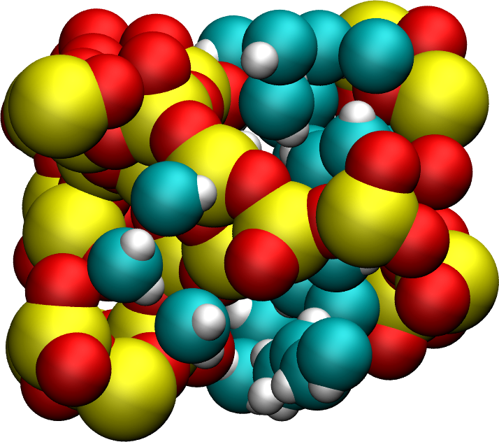

.. _gcmc-silica-label:

Water adsorption in silica
**************************

.. container:: hatnote

    Dealing with a varying number of molecules

.. figure:: ../figures/level3/water-adsorption-in-silica/main-dark.png
    :height: 250
    :alt: Water molecules adsorbed in silica SiO2 porous inorganic material
    :class: only-dark
    :align: right

..  container:: justify

    The objective of this tutorial is to combine molecular
    dynamics and grand canonical Monte Carlo simulations to
    compute the adsorption of water molecules in a cracked silica material.

    This tutorial illustrates the use of the grand canonical
    ensemble in molecular simulation, an open ensemble in which the number of 
    molecules or atoms is not constant.

.. include:: ../../contact/recommand-lj.rst

.. include:: ../../contact/needhelp.rst

Generation of the silica block
==============================

..  container:: justify

    Let us first generate a block of amorphous silica (SiO2). To do
    so, we are going to replicate a building block containing 3
    Si and 6 O atoms. 
    
    Create two folders side by side, and name them respectively *Potential/*
    and *SilicaBlock/*.

    An initial data file for the SiO atoms can be
    downloaded by clicking |download_SiO.data|.
    Save it in *SilicaBlock/*. This data file
    contains the coordinates of the 9 atoms, their masses, and
    their charges. The fine can be directly read by LAMMPS using the
    *read_file* command. Let us replicate these atoms using
    LAMMPS, and apply an annealing procedure to obtain a block
    of amorphous silica.

.. admonition:: About annealing procedure
    :class: dropdown

    The annealing procedure consists of adjusting the system temperature in successive steps.
    Here, a large initial temperature is chosen to ensure the melting of the SiO2 structure.
    Then, several steps are used to progressively cool down the system until it solidifies and forms 
    amorphous silica. Depending on the material, different cooling velocities can sometimes
    lead to different crystal structure or different degree of defect.

Vashishta potential
-------------------

..  container:: justify

    Create a new input file named *input.lammps* in the *SilicaBlock/* folder, and copy
    the following lines in it:

.. |download_SiO.data| raw:: html

   <a href="../../../../../inputs/level3/water-adsorption-in-silica/SilicaBlock/SiO.data" target="_blank">here</a>

..  code-block:: lammps
    :caption: *to be copied in SilicaBlock/input.lammps*

    units metal
    boundary p p p
    atom_style full
    pair_style vashishta
    neighbor 1.0 bin
    neigh_modify delay 1

..  container:: justify

    The main difference between the previous tutorials is the use of 
    the Vashishta pair style. Download the Vashishta potential by
    clicking |download_vashishta|, and copy it within the *Potential/* folder.

.. admonition:: About the Vashishta potential
    :class: info

    The |website_vashishta|
    potential is a bond-angle energy based potential, it
    deduces the bonds between atoms from their relative
    positions. Therefore, there is no need to provide bond
    and angle information as we do with classic force fields
    like GROMOS or AMBER.
    
    Note that Vashishta potential requires the use of metal units system. 
    
    Bond-angle energy based potentials
    are more computationally heavy than classical force
    fields and require the use of a smaller timestep, but
    they allow for the modelling of bond formation and
    breaking, which is what we need here as we want to create
    a crack in the silica.

..  container:: justify

    Let us then import the system made of 9 atoms, replicate it four times in all three
    directions of space, thus creating a system with 576 atoms.

..  code-block:: lammps
    :caption: *to be copied in SilicaBlock/input.lammps*

    read_data SiO.data
    replicate 4 4 4

..  container:: justify

    Then, let us specify the pair coefficients by indicating
    that the first atom type is Si, and the second is O. Let us also
    add a dump command for printing out the positions of the
    atoms every 5000 steps:

.. |download_vashishta| raw:: html

   <a href="../../../../../inputs/level3/water-adsorption-in-silica/Potential/SiO.1990.vashishta" target="_blank">here</a>

.. |website_vashishta| raw:: html

   <a href="https://pubmed.ncbi.nlm.nih.gov/9993674/" target="_blank">Vashishta</a>

..  code-block:: lammps
    :caption: *to be copied in SilicaBlock/input.lammps*

    pair_coeff * * ../Potential/SiO.1990.vashishta Si O

..  container:: justify

    Let us add some commands to help us follow the evolution of the system,
    such as its temperature, volume, and potential-energy:

..  code-block:: lammps
    :caption: *to be copied in SilicaBlock/input.lammps*

    dump dmp all atom 5000 dump.lammpstrj
    variable myvol equal vol
    variable mylx equal lx
    variable myly equal ly
    variable mylz equal lz
    variable mypot equal pe
    fix myat1 all ave/time 10 100 1000 v_mytemp file temperature.dat
    fix myat2 all ave/time 10 100 1000 v_myvol v_mylx v_myly v_mylz file dimensions.dat
    fix myat3 all ave/time 10 100 1000 v_mypot file potential-energy.dat
    thermo 1000

Annealing procedure
-------------------

..  container:: justify

    Finally, let us create the last part of our script. The
    annealing procedure is the following: we first start with a
    small phase at 6000 K, then cool down the system to 4000 K
    using a pressure of 100 atm. Then we cool down the system
    further while also reducing the pressure, then perform a
    small equilibration step at the final desired condition, 300
    K and 1 atm.

    *Disclaimer --* I created this procedure by intuition and
    not from proper calibration, do not copy it without
    making your own tests if you intend to publish your
    results.

..  code-block:: lammps
    :caption: *to be copied in SilicaBlock/input.lammps*

    velocity all create 6000 4928459 rot yes dist gaussian
    fix npt1 all npt temp 6000 6000 0.1 iso 100 100 1
    timestep 0.001
    run 50000
    fix npt1 all npt temp 6000 4000 0.1 aniso 100 100 1
    run 50000
    fix npt1 all npt temp 4000 300 0.1 aniso 100 1 1
    run 200000
    fix npt1 all npt temp 300 300 0.1 aniso 1 1 1
    run 50000

    write_data amorphousSiO.data

.. admonition:: Anisotropic versus isotropic barostat
    :class: info

    Here, an isotropic barostat is used for the melted phase at 6000 K, and then 
    an anisotropic barostat when cooling down the system. With the anisotropic 
    barostat, all three directions of space are adjusted independently from one another. Such
    anisotropic barostat is usually a better choice for a solid phase, 
    when there is no reason for the final solid phase to
    have the same dimensions along all 3 axis. For a
    liquid or a gas, the isotropic barostat is usually the best choice.

..  container:: justify

    The simulation takes about 15-20 minutes on 4 cpu cores.

    Let us check the evolution of the temperature from the *temperature.dat* file.
    Apart from an initial spike (may be due to an initial bad configuration, probably harmless here),
    the temperature follows well the desired annealing procedure:

.. figure:: ../figures/level3/water-adsorption-in-silica/temperature_evolution-dark.png
    :alt: silica temperature during annealing, from melt to solid
    :class: only-dark

.. figure:: ../figures/level3/water-adsorption-in-silica/temperature_evolution-light.png
    :alt: silica temperature during annealing, from melt to solid
    :class: only-light

..  container:: justify

    Let us also make sure that the box was indeed deformed isotropically during the first 
    stage of the simulation, and then anisotropically by plotting lx (blue), ly (orange), and lz:

.. figure:: ../figures/level3/water-adsorption-in-silica/dimensions_evolution-dark.png
    :alt: box dimensions during annealing, from melt to solid
    :class: only-dark

.. figure:: ../figures/level3/water-adsorption-in-silica/dimensions_evolution-light.png
    :alt: box dimensions during annealing, from melt to solid
    :class: only-light

..  container:: justify

    After running the simulation, the final LAMMPS topology file named
    *amorphousSiO.data* will be located in *SilicaBlock/*. Alternatively, if you are only interested in the
    next steps of this tutorial, you can download it by clicking
    |download_silica_block|.

    The final system resembles the image below, where the oxygen
    atoms are in red and the silicon atoms in yellow:

.. |download_silica_block| raw:: html

   <a href="../../../../../inputs/level3/water-adsorption-in-silica/SilicaBlock/amorphousSiO.data" target="_blank">here</a>

.. figure:: ../figures/level3/water-adsorption-in-silica/generated-silica-dark.png
    :alt: silica block generated by temperature annealing using LAMMPS
    :class: only-dark

.. figure:: ../figures/level3/water-adsorption-in-silica/generated-silica-light.png
    :alt: silica block generated by temperature annealing using LAMMPS
    :class: only-light

    Side and top view of the amorphous silica (SiO2) block.

..  container:: justify

.. admonition:: Tip for research project
    :class: dropdown

    In the case of a research project, the validity of the generated
    structure must be tested and compared to reference values, ideally from
    experiments. 
    
    For instance, radial distribution functions or Young modulus
    can both be compared to experimental values. This is beyond the
    scope of this tutorial.

Cracking the silica
===================

..  container:: justify

    Let us dilate the block of silica to create a
    crack. Create a new folder called *Cracking/* next to *SilicaBlock/*, and create a
    new input.lammps file starting with:

..  code-block:: lammps
    :caption: *to be copied in Cracking/input.lammps*

    units metal
    boundary p p p
    atom_style full
    neighbor 1.0 bin
    neigh_modify delay 1

    read_data ../SilicaBlock/amorphousSiO.data

    pair_style vashishta
    pair_coeff * * ../Potential/SiO.1990.vashishta Si O
    dump dmp all atom 1000 dump.lammpstrj

..  container:: justify

    Then, let us progressively increase the size of the
    box in the z direction, thus forcing the silica to deform and crack. To do
    so, we are going to make a loop using the jump command. At
    every step of the loop, the box dimension over x will
    be multiplied by a factor 1.005. Here, we use a NVT
    thermostat because we want to impose a deformation of the
    volume.

.. admonition:: NVT vs 2D barostat
    :class: dropdown

    Here, box deformations are applied in the x-direction, while the 
    y and z box dimensions are kept constants. 

    Another possible choice would be to apply a barostat along the y and z 
    direction, allowing the system more freedom to deform. In LAMMPS, this 
    can be done by using :

    .. code-block:: lammps

        fix npt1 all npt temp 300 300 0.1 y 1 1 1 z 1 1 1

    instead of:
    
    .. code-block:: lammps

        fix nvt1 all nvt temp 300 300 0.1

    Here, the latter command will be used (see below), but feel free to improvise.

..  container:: justify
    
    Add the following lines to the input script:

.. code-block:: lammps
    :caption: *to be copied in Cracking/input.lammps*

    fix nvt1 all nvt temp 300 300 0.1
    timestep 0.001
    thermo 1000
    variable var loop 45
    label loop
    change_box all x scale 1.005 remap
    run 2000
    next var
    jump input.lammps loop
    run 20000
    write_data dilatedSiO.data

..  container:: justify

    Use different factor (1.005) or different number of 
    loop (45) if you want to generate different defects in the silica.

    After the dilatation, a final equilibration step of 20
    picoseconds is performed. If you look at the dump file
    produced after executing this script, or at |video_dilatation|,
    you can see the dilatation occurring step-by-step, and the
    atoms adjusting progressively to the box size. 
    
    At first, the deformations
    are reversible (elastic regime). At some point, bonds
    start breaking and dislocations appear (plastic regime). 
    
    Alternatively, you
    can download the final state directly by clicking
    |download_silica_dilated|. The final system, with the crack, resembles:

.. |video_dilatation| raw:: html

   <a href="https://www.youtube.com/watch?v=8rBqYIcTgno&ab_channel=SimonGravelle" target="_blank">this video</a>

.. |download_silica_dilated| raw:: html

   <a href="../../../../../inputs/level3/water-adsorption-in-silica/Cracking/dilatedSiO.data" target="_blank">here</a>

.. figure:: ../figures/level3/water-adsorption-in-silica/cracked-dark.png
    :alt: silica block with crack
    :class: only-dark

.. figure:: ../figures/level3/water-adsorption-in-silica/cracked-light.png
    :alt: silica block with crack
    :class: only-light

    Block of silica with holes and deformed bonds.

.. admonition:: Passivated silica
    :class: dropdown

    In ambient conditions, silicon (Si) atoms are chemically
    passivated by forming covalent bonds with hydrogen (H)
    atoms. For the sake of simplicity, we are not going to
    decorate the silica with hydrogen atoms in this tutorial.
    This requires a procedure to properly insert hydrogen (as done in one 
    exercise from this tutorial : :ref:`reactive-silicon-dioxide-label`)
    atoms at the right place, or/and the use of another potential.

.. include:: ../../contact/supportme.rst

Adding water
============

.. admonition:: About the GCMC method
    :class: info

    In order to add the water molecules to the silica, we are
    going to use the Monte Carlo method in the grand canonical
    ensemble (GCMC). In short, the system is put into contact
    with a virtual reservoir of given chemical potential
    :math:`\mu`, and multiple attempts to insert water
    molecules at random positions are made. Attempts are
    either accepted or rejected based on energy consideration.

    If you are interested in learning more about GCMC, I am developing
    another website with the goal of delving deeper into the algorithms: |mdcourse|.

.. |mdcourse| raw:: html

   <a href="https://mdcourse.github.io" target="_blank">mdcourse.github.io</a>

Using hydrid potentials
-----------------------

..  container:: justify

    In a new folder called *Addingwater/*, add this template file
    for the water molecule: |download_TIP4P2005|.

    Create a new input file, and copy the following lines into it:

.. |download_TIP4P2005| raw:: html

   <a href="../../../../../inputs/level3/water-adsorption-in-silica/AddingWater/TIP4P2005.txt" target="_blank">TIP4P2005.txt</a>

..  code-block:: lammps
    :caption: *to be copied in Addingwater/input.lammps*

    units metal
    boundary p p p
    atom_style full
    neighbor 1.0 bin
    neigh_modify delay 1
    pair_style hybrid/overlay vashishta lj/cut/tip4p/long 3 4 1 1 0.1546 10
    kspace_style pppm/tip4p 1.0e-4
    bond_style harmonic
    angle_style harmonic

..  container:: justify

    There are several differences with the previous input files
    used in this tutorial because, from now on, the system will combine water and silica.
    Two force fields are combined, Vashishta for
    SiO, and lj/cut/tip4p/long for TIP4P water model, which is
    done using the hybrid/overlay pair style.
    The kspace solver is used to calculate the long
    range Coulomb interactions associated with tip4p/long.
    Finally, the style for the bonds and angles
    of the water molecules are defined (although not important
    since its a rigid water model).

    Before going further, we also need to make a few change to our data file.
    Currently, *dilatedSiO.data* only includes two atom types, but
    we need four. Copy the previously generated *dilatedSiO.data*
    file within *Addingwater/*. Currently, *dilatedSiO.data* starts with:

..  code-block:: lammps

    LAMMPS data file via write_data, version 2 Aug 2023, timestep = 110000, units = metal

    576 atoms
    2 atom types

    -5.512084438507452 26.09766215010596 xlo xhi
    -0.12771230207837192 20.71329001367807 ylo yhi
    3.211752393088563 17.373825318513106 zlo zhi

    Masses

    1 28.0855
    2 15.9994

    Atoms # full

    (...)

..  container:: justify

    Make the following changes to allow for the addition of water
    molecules. Modify the file so that it looks like the following 
    (with 4 atom types, 1 bond type, 1 angle type, and four masses):

..  code-block:: lammps

    LAMMPS data file via write_data, version 30 Jul 2021, timestep = 90000

    576 atoms
    4 atom types
    1 bond types
    1 angle types

    2 extra bond per atom
    1 extra angle per atom
    2 extra special per atom

    0.910777522101565 19.67480018949893 xlo xhi
    2.1092682236518137 18.476309487947546 ylo yhi
    -4.1701120819606885 24.75568979356097 zlo zhi

    Masses

    1 28.0855
    2 15.9994
    3 15.9994
    4 1.008

    Atoms # full

    (...)

..  container:: justify

    Doing so, we anticipate that there will be 4 atoms types in
    the simulations, with O and H of H2O having indexes 3 and 4,
    respectively. There will also be 1 bond type and 1 angle
    type. The extra bond, extra angle, and extra special lines
    also need to be added for memory allocation. 

    We can continue to fill in the
    input.lammps file, by adding the system definition:

..  code-block:: lammps
    :caption: *to be copied in Addingwater/input.lammps*

    read_data dilatedSiO.data
    molecule h2omol TIP4P2005.txt
    lattice sc 3
    create_atoms 0 box mol h2omol 45585
    lattice none 1

    group SiO type 1 2
    group H2O type 3 4

..  container:: justify

    After reading the data file and defining the h2omol molecule
    from the txt file, the *create_atoms* command is used to
    include some water molecules in the system on a 
    simple cubic lattice. Not adding a molecule before starting the
    GCMC steps usually lead to failure. Note that here,
    most water molecules are overlapping with the silica. These 
    overlapping water molecules will be deleted before 
    starting the simulation. 

    Then, add the following settings:

..  code-block:: lammps
    :caption: *to be copied in Addingwater/input.lammps*

    pair_coeff * * vashishta ../Potential/SiO.1990.vashishta Si O NULL NULL
    pair_coeff * * lj/cut/tip4p/long 0 0
    pair_coeff 1 3 lj/cut/tip4p/long 0.0057 4.42 # epsilonSi = 0.00403, sigmaSi = 3.69
    pair_coeff 2 3 lj/cut/tip4p/long 0.0043 3.12 # epsilonO = 0.0023, sigmaO = 3.091
    pair_coeff 3 3 lj/cut/tip4p/long 0.008 3.1589
    pair_coeff 4 4 lj/cut/tip4p/long 0.0 0.0
    bond_coeff 1 0 0.9572
    angle_coeff 1 0 104.52

    variable oxygen atom "type==3"
    group oxygen dynamic all var oxygen
    variable nO equal count(oxygen)
    fix myat1 all ave/time 100 10 1000 v_nO file numbermolecule.dat

    fix shak H2O shake 1.0e-4 200 0 b 1 a 1 mol h2omol

..  container:: justify

    The force field Vashishta applies only to Si (type 1) and O of SiO2 (type 2),
    and not to the O and H of H2O, thanks to the NULL
    parameters used for atoms of types 3 and 4. 
    
    Pair coefficients for lj/cut/tip4p/long are
    defined between O atoms, as well as between
    O(SiO)-O(H2O) and Si(SiO)-O(H2O). Therefore, the fluid-solid 
    interactions will be set by Lennard Jones and Coulomb potential. 
    
    The number of oxygen atoms from water molecule (i.e. the number of molecule)
    will be printed in the file *numbermolecule.dat*.
    
    The shake algorithm is used to
    maintain the shape of the water molecule over time. Some of
    these features have been seen in previous tutorials.

    Let us delete the overlapping water molecules, and print the 
    positions in a dump file:

..  code-block:: lammps
    :caption: *to be copied in Addingwater/input.lammps*

    delete_atoms overlap 2 H2O SiO mol yes
    dump dmp all atom 1000 dump.init.lammpstrj

GCMC simulation
---------------

..  container:: justify

    Let us make a first equilibration step:

..  code-block:: lammps
    :caption: *to be copied in Addingwater/input.lammps*

    compute_modify thermo_temp dynamic yes
    compute ctH2O H2O temp
    compute_modify ctH2O dynamic yes
    fix mynvt1 H2O nvt temp 300 300 0.1
    fix_modify mynvt1 temp ctH2O
    compute ctSiO SiO temp
    fix mynvt2 SiO nvt temp 300 300 0.1
    fix_modify mynvt2 temp ctSiO
    timestep 0.001
    thermo 1000
    run 5000

.. admonition:: On thermostating groups instead of the entire system
    :class: info

    Two different thermostats are used for SiO and for H2O, respectively. Using 
    separate thermostat is usually better when the system contains two separate species, such as one solid and one
    liquid. It is particularly important to use two thermostats
    here, because the number of water molecules will fluctuate with time.
    
..  container:: justify

    The compute_modify 'dynamic yes' for water is used to specify that the
    number of molecules is not constant.

    Finally, let us use the fix gcmc and perform the grand
    canonical Monte Carlo steps:

..  code-block:: lammps
    :caption: *to be copied in Addingwater/input.lammps*

    variable tfac equal 5.0/3.0
    variable xlo equal xlo+0.1
    variable xhi equal xhi-0.1
    variable ylo equal ylo+0.1
    variable yhi equal yhi-0.1
    variable zlo equal zlo+0.1
    variable zhi equal zhi-0.1
    region system block ${xlo} ${xhi} ${ylo} ${yhi} ${zlo} ${zhi} 
    fix fgcmc H2O gcmc 100 100 0 0 65899 300 -0.5 0.1 mol h2omol tfac_insert ${tfac} group H2O shake shak full_energy pressure 10000 region system
    run 25000
    write_data SiOwithwater.data
    write_dump all atom dump.lammpstrj

.. admonition:: Dirty fix
    :class: info

    The *system* was created to avoid the error "Fix gcmc region extends outside simulation box"
    which seems to occur with some LAMMPS version.

..  container:: justify

    The tfac_insert option ensures that the correct estimate is
    made for the temperature of the inserted water molecules by
    taking into account the internal degrees of freedom. Running
    this simulation, you should see the number of molecule
    increasing progressively. When using the pressure argument,
    LAMMPS ignores the value of the chemical potential [here :math:`\mu = -0.5` eV
    which corresponds roughly to ambient conditions (i.e. RH approx 50%).]
    The large pressure value of 10000 bars was chosen to ensure that 
    some successful insertions of molecules would occur during the 
    relatively short duration of the simulation.

    When you run the simulation, make sure that some water molecules 
    remain in the system after the delete_atoms command. You can control 
    that either using the log file, or using the *numbermolecule.dat* data file.

    Depending on your LAMMPS version, you may have to run LAMMPS
    on a single cpu core, due to some restrictions of the fix gcmc.

    You can see, by looking at the log file, that 280 molecules
    were added by the *create_atoms* command (the exact number may differ):

..  code-block:: bw
    :caption: *from the log file*

    Created 840 atoms

..  container:: justify

    You can also see that 258 molecules where immediately deleted,
    leaving 24 water molecules (the exact number may differ):

..  code-block:: bw
    :caption: *from the log file*

    Deleted 774 atoms, new total = 642
    Deleted 516 bonds, new total = 44
    Deleted 258 angles, new total = 22

..  container:: justify

    After 100000 steps, you should see that the number of molecules increases with time, 
    and reaches a plateau:

.. figure:: ../figures/level3/water-adsorption-in-silica/number_evolution-dark.png
    :alt: number of water molecules added by the LAMMPS gcmc
    :class: only-dark

.. figure:: ../figures/level3/water-adsorption-in-silica/number_evolution-light.png
    :alt: number of water molecules added by the LAMMPS gcmc
    :class: only-light

..  container:: justify

    Note that the final number of molecules depends on the imposed pressure, 
    temperature, and on the interaction between water and silica (its hydrophilicity). 

    Here is the final state, with the oxygen of the
    water molecules represented in cyan to improve the contrast with the silica:

.. figure:: ../figures/level3/water-adsorption-in-silica/solvated-dark.png
    :alt: silica block with water and crack
    :class: only-dark

.. figure:: ../figures/level3/water-adsorption-in-silica/solvated-light.png
    :alt: silica block with water and crack
    :class: only-light

    Cracked silica with adsorbed water molecules (in cyan).

..  container:: justify

    Note that gcmc simulations of such dense phases are usually slow to converge due to the
    very low probability of successfully inserting a molecule. Here, the short simulation 
    duration was made possible by the use of a huge pressure.

.. admonition:: Vizualising varying number of molecules
    :class: info

    By default, VMD fails to properly render systems with varying number of atoms,
    but Ovito does it well.